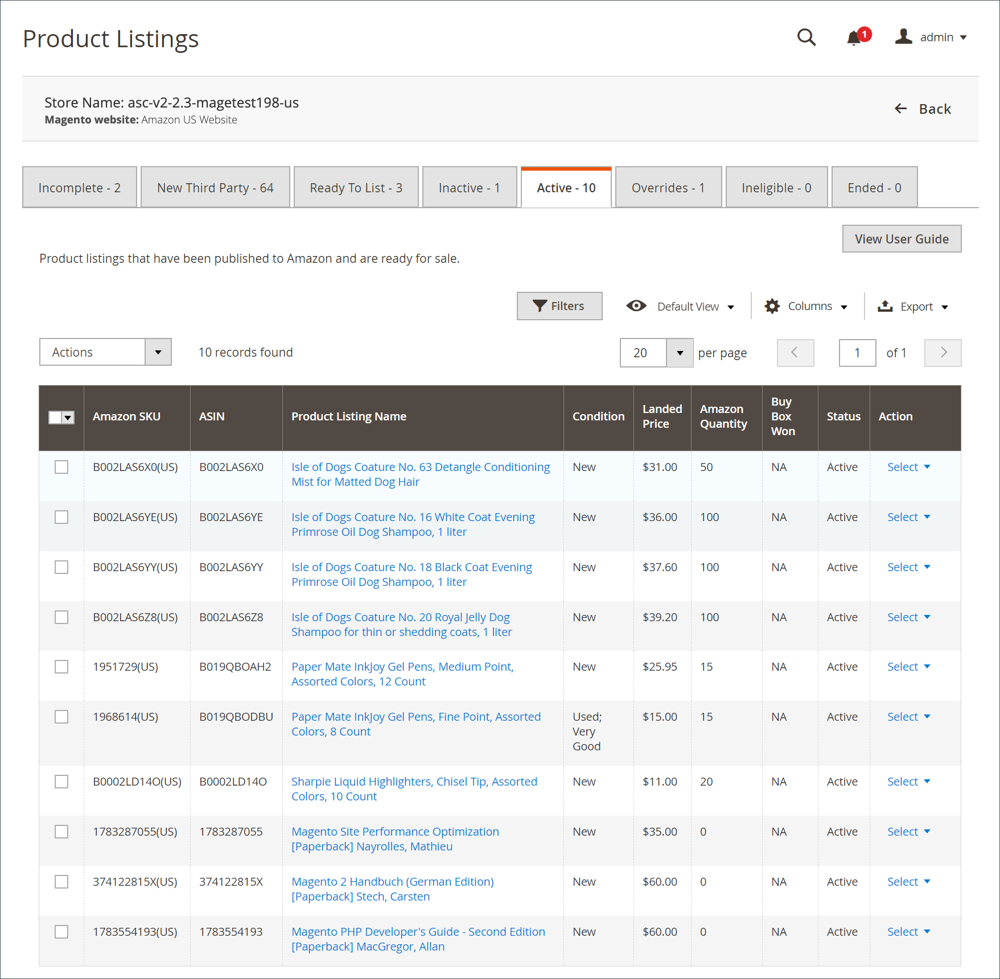

# Aktive Auflistungen

Die _[!UICONTROL Active]_auf der Registerkarte werden Ihre Amazon-Auflistungen angezeigt, die auf der [!DNL Amazon Marketplace] und die mit einem Produkt in Ihrem [!DNL Commerce] Katalog.

Die verfügbaren Maßnahmen im Rahmen der _[!UICONTROL Active]_Registereinschluss:

Unter _[!UICONTROL Actions]_:

- **[!UICONTROL End Listing(s) on Amazon]**: Wählen Sie, ob alle ausgewählten Auflistungen aus dem [!DNL Amazon Marketplace]. Siehe [Amazon-Liste beenden](./end-listings-manually.md).

- **[!UICONTROL Edit Listing Overrides]**: Wählen Sie aus, die Einstellungen für die Überschreibung der Liste zu ändern. Siehe [Überschreibungen](./overrides.md) oder [Überschreiben bearbeiten oder entfernen](./creating-editing-overrides.md#edit-override-single-listing).

Unter **[!UICONTROL Select]** in _[!UICONTROL Action]_Spalte:

- **[!UICONTROL View Details]**: Wählen Sie eine Ansicht aus, in der Details wie [Listing-Aktivität-Protokoll](./product-listing-details.md#listing-activity-log), [Buy Box Konkurrent-Preise](./product-listing-details.md#buy-box-competitor-pricing)und [Niedrigste Konkurrent-Preise](./product-listing-details.md#lowest-competitor-pricing). Diese Aktion dient nur zum Anzeigen. In den Details der Auflistung können keine Änderungen vorgenommen werden. Siehe [Ansicht - Details](./product-listing-details.md).

- **[!UICONTROL Create Override]**: Wählen Sie , um eine Überschreibung zu erstellen und sie auf diese Auflistung anzuwenden. Siehe [Überschreibung erstellen](./creating-editing-overrides.md).

- **[!UICONTROL Edit Assigned ASIN]**: Wählen Sie , um das Ihrem Katalogprodukt zugewiesene ASIN zu ändern. Verwenden Sie diese Aktion, wenn ein Produkt in Ihrem Katalog mit dem falschen ASIN übereinstimmt. Siehe [Zugewiesenes ASIN bearbeiten](./edit-assigned-asin.md).

- **[!UICONTROL Create Alias Seller SKU]**: Wählen Sie, ob Sie eine Alias-SKU erstellen möchten, die zum Erstellen einer Amazon-Auflistung aus demselben Katalogprodukt verwendet werden kann. Siehe [Alias-Verkäufer-SKU erstellen](./create-alias-seller-sku.md).

- **[!UICONTROL Switch to Fulfilled by Amazon/Merchant]**: Wählen Sie aus, die der Bestellung zugeordnete Fulfillment-Methode zu ändern. Siehe [Fulfillment-by-Einstellungen konfigurieren](./fulfilled-by.md#configure-fulfilled-by-settings).

- **[!UICONTROL End Listing]**: Wählen Sie , um die Liste aus dem [!DNL Amazon Marketplace]. Siehe [Amazon-Liste beenden](./end-listings-manually.md).

>[!NOTE]
>
>Wenn Sie Listen in Bearbeitung haben, wird die Anzahl der Einträge in einer Meldung über den Registerkarten angezeigt.

Amazon Sales Kanal Startseite teilen einige gemeinsame [Arbeitsbereichssteuerelemente](./workspace-controls.md) , mit denen Sie die angezeigten Daten anpassen können.

| Spalte | Beschreibung |
|--- |--- |
| [!UICONTROL Amazon Seller SKU] | Die von Amazon einem Produkt zugewiesene SKU (Stock Keeping Unit) zur Identifizierung des Produkts, der Optionen, des Preises und des Herstellers. |
| [!UICONTROL ASIN] | Ein eindeutiger Block mit 10 Buchstaben und/oder Zahlen, die Elemente identifizieren.   ASIN steht für [!DNL Amazon Standard Identification Number]. Ein ASIN ist ein eindeutiger Block mit 10 Buchstaben und/oder Ziffern, der Elemente identifiziert. Für Bücher ist die ASIN die gleiche ISBN-Nummer, aber für alle anderen Produkte wird ein neues ASIN erstellt, wenn das Element in ihren Katalog hochgeladen wird. Auf der Produktdetailseite auf Amazon finden Sie ASIN und weitere Details zum Artikel. |
| [!UICONTROL Product Listing Name] | Der Name des Produkts. |
| [!UICONTROL Condition] | Die [Bedingung](./product-listing-condition.md) des Erzeugnisses. |
| [!UICONTROL Landed Price] | Der Listenpreis des Produkts zuzüglich des Versandpreises. |
| [!UICONTROL Amazon Quantity] | Die Menge, die verfügbar ist, nachdem das Produkt aktiv auf Amazon aufgeführt wurde. |
| [!UICONTROL Status] | Der von Amazon definierte Status der Auflistung. |
| [!UICONTROL Buy Box Won] | Gibt an, ob die Produktauflistung den [Buy Box](./buy-box-competitor-pricing.md) Position. |
| [!UICONTROL Action] | Liste der verfügbaren Aktionen, die auf eine bestimmte Auflistung angewendet werden können. Klicken Sie zum Anwenden einer Aktion auf **[!UICONTROL Select]** in _[!UICONTROL Action]_Spalte, in der Ihre Optionen angezeigt werden:<ul><li>[[!UICONTROL View Details]](./product-listing-details.md)</li><li>[[!UICONTROL Create Override]](./creating-editing-overrides.md)</li><li>[[!UICONTROL Edit Assigned ASIN]](./edit-assigned-asin.md)</li><li>[[!UICONTROL Create Alias Seller SKU]](./create-alias-seller-sku.md#region-specific)</li><li>[[!UICONTROL Switch to Fulfilled By Amazon/Merchant]](./fulfilled-by.md#configure-fulfilled-by-settings)</li><li>[[!UICONTROL End Listing]](./end-listings-manually.md)</li></ul> |
