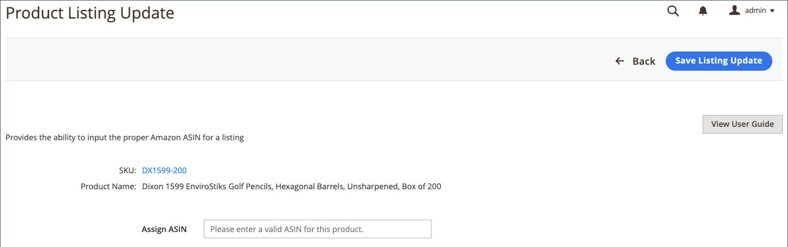
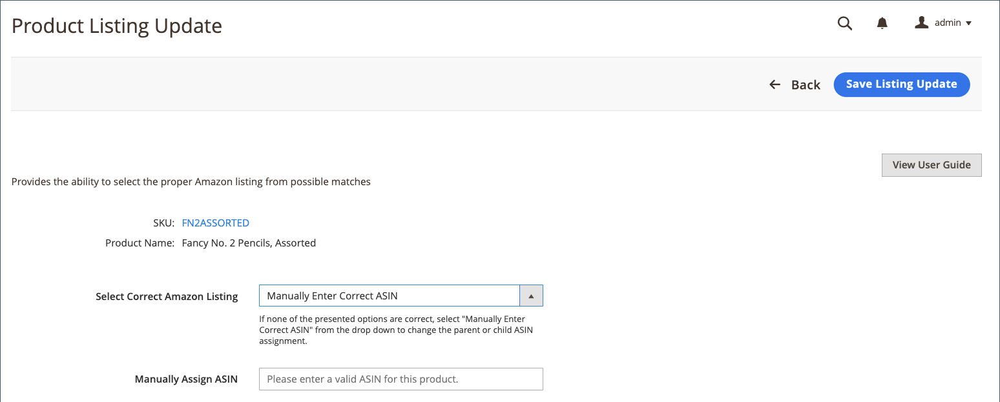

# Erforderliche Informationen aktualisieren (unvollständige Auflistung)

Auflistungen, die auf der _[!UICONTROL Incomplete]_Tabulator einschließen [!DNL Commerce] Katalogprodukte, die die Amazon-Anforderungen erfüllen, wie sie in Ihren Listungsregeln definiert sind, aber Informationen enthalten, die von Amazon vor der Auflistung benötigt werden.

## Erforderliche Informationen aktualisieren (Zuweisung zur Amazon-Liste nicht möglich) {#update-required-info-unable-to-assign-to-amazon-listing}

1. Ansicht der Auflistungen auf der _[!UICONTROL Incomplete]_Tabulator in [Listen verwalten](./managing-product-listings.md).

1. In _[!UICONTROL Action]_Spalte, klicken **[!UICONTROL Select]**>**[!UICONTROL Update Required Info]**für die Liste, die Sie aktualisieren möchten.

1. Überprüfen Sie die Katalogproduktinformationen (SKU und Produktname), für die Sie eine Übereinstimmung mit einer Amazon-Auflistung herstellen möchten.

1. für **[!UICONTROL Assign ASIN]**, geben Sie die von Amazon zugewiesene ASIN für die Liste ein, die mit dem Katalogprodukt übereinstimmen soll.

1. Klicken Sie zum Speichern der Produktübereinstimmung auf **[!UICONTROL Save Listing Update]**.

Die Auflistung ist jetzt mit Ihrem Katalog abgestimmt. Die Liste wird dann aktualisiert und gemäß Ihren cron- und listungseinstellungen auf Amazon veröffentlicht. Es wird auch aus dem _[!UICONTROL Incomplete]_Tabulator.

## Erforderliche Informationen aktualisieren (Mehrere Übereinstimmungen gefunden) {#update-required-info-multiple-matches-found}

1. Ansicht der Auflistungen auf der _[!UICONTROL Incomplete]_Tabulator in [[!UICONTROL Manage Listings]](./managing-product-listings.md).

1. In _Aktion_ Spalte, klicken **Auswählen** > **Erforderliche Informationen aktualisieren** für die Liste, die Sie aktualisieren möchten.

1. Überprüfen Sie die Katalogproduktinformationen (SKU und Produktname), für die Sie eine Übereinstimmung mit einer Amazon-Auflistung herstellen möchten.

1. für **[!UICONTROL Select Correct Amazon Listing]**, wählen Sie das richtige ASIN für die Liste aus, die Sie diesem Produkt hinzufügen möchten.

   Die hier aufgeführten Optionen umfassen Katalogprodukte, die als mögliche Übereinstimmungen identifiziert werden. Wenn keine der Optionen korrekt ist, können Sie auswählen `Manually Enter Correct ASIN` und geben Sie die ASIN für das Produkt manuell ein.

1. Wenn Sie das ASIN manuell eingeben, geben Sie das richtige ASIN ein für **[!UICONTROL Manually Assign ASIN]**.

1. Klicken Sie zum Speichern der Produktübereinstimmung auf **[!UICONTROL Save Listing Update]**.

## Erforderliche Informationen aktualisieren (enthält Varianten) {#update-required-info-has-variants}

1. Ansicht der Auflistungen auf der _[!UICONTROL Incomplete]_Tabulator in [[!UICONTROL Manage Listings]](./managing-product-listings.md).

1. In _[!UICONTROL Action]_Spalte, klicken **[!UICONTROL Select]**>**[!UICONTROL Update Required Info]**für die Liste, die Sie aktualisieren möchten.

1. Überprüfen Sie die Katalogproduktinformationen (SKU und Produktname), für die Sie eine Übereinstimmung mit einer Amazon-Auflistung herstellen möchten.

1. für **[!UICONTROL Select Correct Amazon Listing]**, wählen Sie das richtige ASIN für die Liste aus, die Sie diesem Produkt hinzufügen möchten.

   Die hier aufgeführten Optionen umfassen Katalogprodukte, die als mögliche Übereinstimmungen identifiziert werden. Wenn keine der Optionen korrekt ist, können Sie `Manually Enter Correct ASIN` und geben Sie die ASIN für das Produkt manuell ein.

1. Wenn Sie das ASIN manuell eingeben, geben Sie das richtige ASIN ein für **[!UICONTROL Manually Assign ASIN]**.

1. Klicken Sie zum Speichern der Produktübereinstimmung auf **[!UICONTROL Save Listing Update]**.

## Erforderliche Informationen aktualisieren (fehlende Bedingung) {#update-required-info-missing-condition}

1. Ansicht der Auflistungen auf der _[!UICONTROL Incomplete]_Tabulator in [Listen verwalten](./managing-product-listings.md).

1. In _[!UICONTROL Action]_Spalte, klicken **[!UICONTROL Select]**>**[!UICONTROL Update Required Info]**für die Liste, die Sie aktualisieren möchten.

1. Überprüfen Sie die Katalogproduktinformationen (SKU und Produktname), für die Sie eine Übereinstimmung mit einer Amazon-Auflistung herstellen möchten.

1. für **[!UICONTROL Condition]**, wählen Sie die entsprechende Bedingung aus.

   Die Liste der verfügbaren Optionen hängt von Ihren [Produktauflistungsbedingung](./product-listing-condition.md) Einstellungen.

1. Klicken Sie zum Speichern der Produktübereinstimmung auf **[!UICONTROL Save Listing Update]** .

