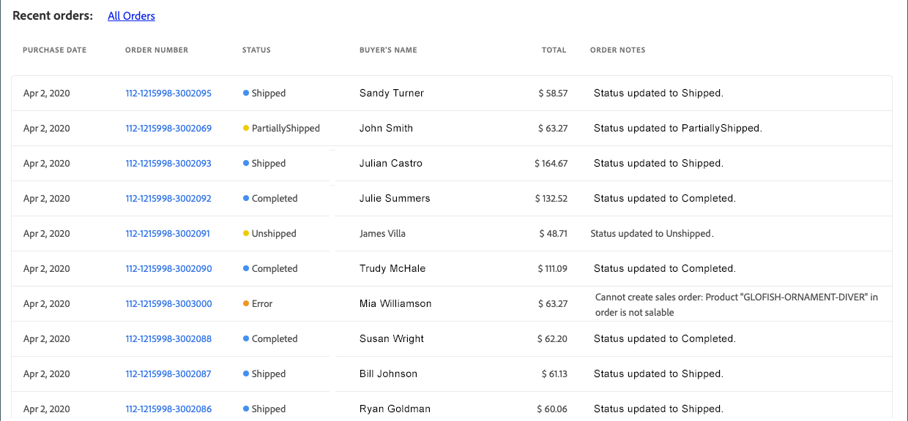

# Anzeigen von Amazon-Bestellungen

Es gibt zwei Möglichkeiten, Ihre Amazon-Bestellungen anzuzeigen: _[!UICONTROL Recent Orders]_und_[!UICONTROL All Orders]_.

Beide Optionen zeigen Ihnen grundlegende Bestellinformationen, die von Amazon empfangen werden, darunter:

- Kaufdatum
- Bestellnummer
- Status
- Name des Käufers
- Gesamtsumme
- Bestellhinweise

_[!UICONTROL All Orders]_-Ansicht fügt Filteroptionen für Auftragssuchvorgänge hinzu.

>[!NOTE]
>
>Außer für _[!UICONTROL Order Notes]_-Spalte_[!UICONTROL Amazon orders]_ -Tabelle mit den von Amazon empfangenen Bestellinformationen gefüllt. Die _Bestellhinweise_ Spalte wird aktualisiert von [!DNL Commerce] als die Reihenfolge verarbeitet.

## Letzte Bestellungen

Sie können Ihre neuesten Bestellungen im _[!UICONTROL Recent Orders]_Abschnitt [Store-Dashboard](./amazon-store-dashboard.md).

### Aktuelle Amazon-Bestellungen anzeigen

1. Klicken **[!UICONTROL View Store]** auf einer Speicherkarte.

1. Zeigen Sie Ihre Bestellungen im _[!UICONTROL Recent Orders]_Abschnitt.

1. Um Bestelldetails anzuzeigen, klicken Sie auf die Amazon-Bestellnummer im _[!UICONTROL Order Number]_Spalte.

   Die _[!UICONTROL Amazon Order Details]_-Seite für die Reihenfolge geöffnet.

## Alle Bestellungen anzeigen

Sie können alle Ihre Amazon-Bestellungen im _[!UICONTROL Amazon orders]_Seite (auch als_[!UICONTROL All Orders]_ Ansicht). Die Amazon-Bestelltabelle ähnelt der _[!UICONTROL Recent Orders]_-Bereich des Store-Dashboards, ermöglicht Ihnen jedoch, alle Ihre Amazon-Bestellungen anzuzeigen und Ihre Bestellliste mit den folgenden Filteroptionen einzuschränken:

- [!UICONTROL Purchase Date (range)]
- [!UICONTROL Order Number]
- [!UICONTROL Buyer's Name]
- [!UICONTROL Total (range)]
- [!UICONTROL Status]

### Alle Amazon-Bestellungen anzeigen

1. Klicken **[!UICONTROL View Store]** auf einer Speicherkarte.

1. Klicken **[!UICONTROL All Orders]** im _[!UICONTROL Recent Orders]_Abschnitt.

1. Um die Liste einzuschränken oder nach einer bestimmten Bestellnummer zu suchen, müssen Sie die **[!UICONTROL Filter by]** Parameter und klicken Sie auf **[!UICONTROL Apply filters]**.

1. Um Bestelldetails anzuzeigen, klicken Sie auf die Amazon-Bestellnummer im _[!UICONTROL Order Number]_Spalte.

   Die _[!UICONTROL Amazon Order Details]_-Seite für die Reihenfolge geöffnet.

## Filter verwenden

Sie können Filter auf Ihre Bestellliste im _[!UICONTROL Filter by]_Abschnitt. Auswählen und klicken Sie auf **[!UICONTROL Apply filters]**. Die angewendeten Filter werden oberhalb des Sortierungsrasters angezeigt.

### Ändern angewendeter Filter

- Sie können Filter in der _[!UICONTROL Filter by]_Abschnitt. Klicken **[!UICONTROL Apply filters]**um die Bestellliste und die Filteroptionen zu aktualisieren, die über dem Bestellraster angezeigt werden.

- Sie können Filter einzeln entfernen, indem Sie auf die `x` für den Filter oder alle auf einmal durch Klicken auf **[!UICONTROL Clear all filters]**. Wenn Sie einen Filter entfernen, werden die Liste der Bestellungen und die Filteroptionen, die über dem Bestellungsraster angezeigt werden, aktualisiert.

- Wenn Ihre Bestellliste lang ist, können Sie die Paginierungssteuerelemente unterhalb des Rasters verwenden, um weitere Bestellungen anzuzeigen.

>[!TIP]
>
>Einige Tipps zur Ansicht der Bestellungen:
>
>- Wenn Sie über mehrere Amazon Store-Integrationen verfügen, kann eine Aktualisierung Ihrer Seitenansicht beim Wechsel zwischen Store-Ansichten erforderlich sein, um sowohl die Bestellliste als auch die Paginierungsansichten für den aktuellen Store zu aktualisieren.
>- Bei der Sortierung nach Spalte gilt die Sortierung nur für die aktuelle Listenansicht. Es empfiehlt sich, die Liste zu filtern und anschließend die Seite zu sortieren, die Sie anzeigen.
>- Abhängig von der Breite des Ansichtsfensters können Sie in den Spalten überlappenden Text sehen. Um die Spalten für den Text zu erweitern, erweitern Sie die Fensteransicht.
>- Beim Filtern nach _[!UICONTROL Total]_, nach Ganzzahlen filtern. Die Eingabe eines Dezimalbetrags kann zu Fehlern in den Ergebnissen führen.

### Standardspalten

| Spalte | Beschreibung |
|---|---|
| [!UICONTROL Filter by] | Nur im _[!UICONTROL All Orders]_anzeigen. Schränken Sie die Liste der Bestellungen auf Grundlage folgender Elemente ein:<ul><li>`Purchase Date (range)`</li><li>`Order Number`</li><li>`Buyer's Name`</li><li>`Total (range)`</li><li>`Status`</li></ul> |
| [!UICONTROL Purchase Date] | Das Datum des Kaufs, wie es von Amazon empfangen wurde. |
| [!UICONTROL Order Number] | Die von Amazon generierte und von ihm empfangene Bestellnummer. Um den Bildschirm &quot;Amazon-Bestelldetails&quot;anzuzeigen, klicken Sie auf den Link. |
| [!UICONTROL Status] | Der Status der Bestellung, wie er von Amazon empfangen wurde. Optionen: `Error` / `Pending` / `Shipped` / `Canceled` / `Completed` / `Unshipped` / `PartiallyShipped` / `PendingAvailability` |
| [!UICONTROL Buyer's Name] | Der Name der Person, die die Bestellung aufgegeben hat, wie er von Amazon empfangen wurde. |
| [!UICONTROL Grand Total] | Der Gesamtwährungswert der Bestellung, wie er von Amazon empfangen wurde. |
| [!UICONTROL Order Notes] | Die letzte Aktion, die für die Bestellung aufgezeichnet wurde, während sie in [!DNL Commerce]. Die Informationen umfassen u. a. Bestellimportfehler und Bestellaktualisierungen. **Hinweis**: Dieses Feld wird von [!DNL Commerce] als die Reihenfolge verarbeitet. |
