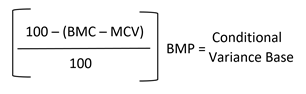

# Intelligente Neupreisregel: Bedingte Unterschiede zwischen Wettbewerbern

Zu den Abschnitten einer intelligenten Neupreisregel gehören:

- [[!UICONTROL Select Rule Type]](./intelligent-repricing-rules.md)
- [!UICONTROL Competitor Conditional Variances]
- [[!UICONTROL Price Adjustment]](./price-adjustment.md)
- [[!UICONTROL Floor Price]](./floor-price.md)
- [[!UICONTROL Optional Ceiling Price]](./optional-ceiling-price.md)

Eine intelligente Neupreisregel nutzt die Preise von Amazon-Konkurrenten, um Ihren Börsennotierungspreis zu bestimmen. Wettbewerber sind andere Verkäufer, die dieselben Produkte auflisten, die Sie in Amazon auflisten.

Wenn ein Produkt mit derselben Bedingung vorhanden ist, ist der Basis-Übereinstimmungspreis der . [kleinster Konkurrent](./lowest-competitor-pricing.md) Preis mit der gleichen Bedingung. Wenn kein konkurrierendes Produkt Ihre Bedingung erfüllt, wird der Basispreis für die Übereinstimmung dann durch andere verfügbare Bedingungen für Konkurrenten ersetzt, die mit Neu, Neu und Fortgeführt werden. Nachdem eine Bedingung gefunden wurde, ist der Basis-Übereinstimmungspreis der niedrigste Preis innerhalb dieser Bedingung.

Wenn ein Produkt mit der Bedingung aufgeführt ist `Used; Good` und dem Basispreis der Übereinstimmung, und ein Wettbewerber hat dasselbe Produkt in derselben Bedingung zu einem niedrigeren Preis, wird der Preis des Konkurrenten verwendet. Wenn ein Wettbewerber nicht mit derselben Bedingung vorhanden ist, sucht das System nach einem Konkurrenten mit der nächsten Bedingung, nämlich `New`. Wird ein Wettbewerber mit dieser Bedingung gefunden, wird der niedrigste Preis verwendet.

## Bedingte Varianten von Konkurrenten konfigurieren

Definieren Sie Ihre Bedingungsabweichungen im _[!UICONTROL Competitor Conditional Variances]_Abschnitt.

Für **[!UICONTROL Conditional Variance]**, wählen Sie eine Option aus:

- `Use all competitor's product conditions` - (Standard) Wählen Sie aus, wann Ihr Produkt mit einer beliebigen verfügbaren Bedingung verglichen werden soll (wenn für die aufgeführte Bedingung keine Übereinstimmung vorhanden ist).

- `Use Only Matching Competitor's Product Condition` - Wählen Sie aus, wann Ihr Produkt nur mit den Produkten des Konkurrenten in derselben Bedingung verglichen werden soll. Wenn keine Übereinstimmung vorhanden ist, wird der Preis für das Produkt am _Magento Price Source_ definiert in [Listenpreis](./listing-price.md).

- `Apply Variance (if competitor's product condition differs)` - Wählen Sie aus, zunächst einen Vergleich mit Ihrer übereinstimmenden Produktbedingung durchzuführen. Wenn keine übereinstimmende Bedingung vorhanden ist, wird eine Abweichung (in Prozent) in Bezug auf Ihre Produktbedingung und die Bedingung des niedrigsten Konkurrenten angewendet.

   Wenn die _[!UICONTROL Apply Variance]_ausgewählt ist, werden für jede Ihrer Amazon-Bedingungen zusätzliche Varianzfelder angezeigt. Diese Funktion ermöglicht Ihnen die Verwendung intelligenter Regeln für die Neuberechnung, wenn Sie Produkte anbieten, die sich in einem anderen Zustand befinden als Ihre Konkurrenten. Um die Berechnung hinter bedingten Abweichungen zu verstehen, müssen Sie zunächst verstehen, dass alle Varianzen anhand eines Basis-Übereinstimmungspreises ermittelt werden.

   Die angezeigten bedingten Varianzoptionen basieren auf Ihren Listeneinstellungen für `Condition` , die mit einem [!DNL Commerce] [Produktattribut](https://experienceleague.adobe.com/docs/commerce-admin/catalog/product-attributes/product-attributes.html). Für alle zugeordneten Bedingungen können Sie einen Varianzprozentsatz von 1-100 definieren. Die Ausnahme sind Sammlerwerte. In diesem Fall kann ein Prozentsatz von mehr als 100 angewendet werden.

{width="500" zoomable="yes"}

| Feld | Beschreibung |
|--- |--- |
| [!UICONTROL Competitor Conditional Variances] | Optionen: <ul><li>**[!UICONTROL Use all competitor's product conditions]** - Wenn für die Bedingung, mit der Sie Ihr Produkt auflisten, keine Übereinstimmung vorhanden ist, wird diese Option mit jeder verfügbaren Bedingung abgeglichen. Zunächst wird versucht, Ihre Bedingung zu erfüllen, und dann wird der Weg von der `New` Bedingung zu `Used; Acceptable`.</li><li>**[!UICONTROL Use only matching competitor's product condition]** - Diese Option entspricht der Bedingung Ihres Produkts. Wenn keine Übereinstimmung vorliegt, werden die Produktpreise zum _[!UICONTROL Magento Price Source]_.</li><li>>**[!UICONTROL Apply variance (if competitor's product condition differs)]** - Diese Option versucht zunächst, eine Übereinstimmung mit Ihrer Produktbedingung herzustellen. Wenn keine übereinstimmende Bedingung vorhanden ist, wird eine Varianz (in Prozent) in Bezug auf Ihre Produktbedingung und die Bedingung des niedrigsten Konkurrenten angewendet.</li></ul>  Die bedingten Varianzoptionen, die basierend auf Ihren Listeneinstellungen für Bedingungen angezeigt werden, die mithilfe einer [!DNL Commerce] [Produktattribut](https://experienceleague.adobe.com/docs/commerce-admin/catalog/product-attributes/product-attributes.html). Bei allen zugeordneten Bedingungen können Sie einen Varianzprozentsatz von 1-100 angeben. Die Ausnahme sind Sammlerwerte. In diesem Fall kann ein Prozentsatz von mehr als 100 angewendet werden.  Diese Funktion ermöglicht Ihnen die Verwendung intelligenter Regeln für die Neuberechnung, wenn Sie Produkte anbieten, die sich in einem anderen Zustand befinden als Ihre Konkurrenten. Um die Berechnung hinter bedingten Abweichungen zu verstehen, müssen Sie zunächst verstehen, dass alle Varianzen anhand eines Basis-Übereinstimmungspreises ermittelt werden. |

## Bedingte Varianzbasis berechnen

- Base Match Condition Variance (BMC) = Die Varianz für die Bedingung Ihres Basis-Match-Preiswettbewerbers. Unter Verwendung des vorherigen Beispiels ist BMC die Varianz für die `New` Bedingung.
- Varianz der Merchant Condition (MCV) = Varianz für die Bedingung Ihres Produkts. Bei Verwendung des vorherigen Beispiels ist MCV = die Varianz für die Variable `Used; Good` Bedingung.
- Basis-Übereinstimmungspreis (BMP) = 7,99 USD (Erklärung oben)

Die Formel zur Berechnung der bedingten Varianzbasis lautet wie folgt:

{width="300"}

## Beispiel

Die bedingten Variableneinstellungen lauten wie folgt:

{width="500" zoomable="yes"}

- BMC = 100 (Konkurrierende Bedingung = Neu)
- MCV = 80 (Handelsbedingung = Verwendet; Gut)
- BMP = 7,99 USD (Basis-Übereinstimmungspreis = niedrigster Preis der übereinstimmenden Konkurrenzbedingung)

{width="300"}

Bei Verwendung der obigen Berechnung der bedingten Varianz ist Ihre bedingte Varianzbasis = 6,39 USD. Diese Berechnung ist die Preisquelle des Konkurrenten, die für Ihre Preisregel-Aktionen verwendet wird. Weitere Informationen finden Sie unter [Preisanpassung](./price-adjustment.md).
