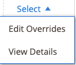

# Erstellen und Bearbeiten von Überschreibungen

Sie können eine Liste erstellen und überschreiben oder eine auf eine Liste angewendete Überschreibung bearbeiten oder entfernen. Überschreibt einen definierten Wert für eine bestimmte Auflistung.

## Erstellen einer Überschreibung für eine einzelne Liste

Die _[!UICONTROL Create Override]_-Aktion ist verfügbar, wenn Sie Listen auf der_[!UICONTROL Inactive]_, _[!UICONTROL Active]_, und_[!UICONTROL Ineligible]_ Registerkarten.

1. Anzeigen einer Liste auf einer _[!UICONTROL Products Listings]_page (_[!UICONTROL Inactive]_, _[!UICONTROL Active]_, und_[!UICONTROL Ineligible]_ Registerkarte).

1. Im _[!UICONTROL Action]_Spalte, klicken **[!UICONTROL Select]**>**[!UICONTROL Create Override]**, um die Seite Produktlistenüberschreibungen zu öffnen.

   {width="220"}

1. Um sicherzustellen, dass Sie die richtige Liste anzeigen, überprüfen Sie die _[!UICONTROL Listing Details]_.

1. Bestimmen Sie den Typ der Überschreibung, die Sie erstellen.

   Sie können einen einzelnen Überschreibungstyp oder eine beliebige Kombination von Typen für die Auflistung definieren (Preis, Bearbeitungszeit, Bedingung, Verkaufshinweise).

   - **Preis** - Klicken **[!UICONTROL Change Listing Price]** und geben Sie Ihren definierten Preiswert für ein **[!UICONTROL Price Override]**.
   - **Verarbeitungszeit** - Klicken **[!UICONTROL Change Handling Time]** und geben Sie den definierten Zeitwert (in Tagen) für **[!UICONTROL Handling Time Override]**.
   - **Bedingung** - Klicken **[!UICONTROL Change Condition]** und wählen Sie die richtige Option für die **[!UICONTROL Condition Override]**.
   - **Verkaufshinweise** - Klicken **[!UICONTROL Change Seller Notes]** und geben Sie den Text für Notizen ein für **[!UICONTROL Seller Notes Override]**.

1. Klicken **[!UICONTROL Save Listing Override]**.

   Die _[!UICONTROL Product Listing Overrides]_Seite geschlossen. Der Status der Auflistung ändert sich in `Relist in Progress`. Die Änderung wird mit der nächsten Datensynchronisation in Amazon veröffentlicht (wie in Ihren Cron-Einstellungen konfiguriert). Die Auflistung wird auch der_[!UICONTROL Overrides]_ Registerkarte.

Das folgende Beispiel zeigt eine Überschreibung, die einen neuen Preis von `$55`, eine neue Bearbeitungszeit von `1 day`, eine neue Bedingung von `Used; Like New`und neuer Text für die Verkaufsnotiz.

{width="600" zoomable="yes"}

## Bearbeiten oder Entfernen einer Überschreibung für eine einzelne Auflistung {#edit-override-single-listing}

Die _[!UICONTROL Edit Overrides]_-Aktion ist verfügbar, wenn Sie Listen auf der_[!UICONTROL Overrides]_ Registerkarte.

1. Anzeigen einer Liste auf der _[!UICONTROL Product Listings]_page (_[!UICONTROL Overrides]_ Registerkarte).

1. Im _[!UICONTROL Action]_Spalte, klicken **[!UICONTROL Select]**>**[!UICONTROL Edit Overrides]**.

   Die _[!UICONTROL Product Listing Overrides]_Seite geöffnet.

   {width="125"}

1. Um sicherzustellen, dass Sie die richtige Liste überschreiben, überprüfen Sie die _[!UICONTROL Listing Details]_.

1. So bearbeiten Sie _[!UICONTROL Override]_festlegen, legen Sie die Abschnitte für den Typ fest, den Sie ändern möchten (Preis, Bearbeitungszeit, Bedingung, Verkaufsmitteilungen).

   Um einen Überschreibungstyp beizubehalten, wählen Sie `No Change To <override type>` (Standardeinstellung). Bei dieser Einstellung bleibt der zuvor definierte Wert zum Außerkraftsetzen unverändert.

   - **Preis** - Klicken **[!UICONTROL Change Listing Price]** und geben Sie Ihren definierten Preiswert für ein **[!UICONTROL Price Override]**.
   - **Verarbeitungszeit** - Klicken **[!UICONTROL Change Handling Time]** und geben Sie den definierten Zeitwert (in Tagen) für **[!UICONTROL Handling Time Override]**.
   - **Bedingung** - Klicken **[!UICONTROL Change Condition]** und wählen Sie die richtige Option für **[!UICONTROL Condition Override]**.
   - **Verkaufshinweise** - Klicken **[!UICONTROL Change Seller Notes]** und geben Sie den Text für Notizen ein für **[!UICONTROL Seller Notes Override]**.

1. Um einen Überschreibungstyp zu entfernen, klicken Sie auf **Entfernen** für jeden Typ, den Sie entfernen möchten. Wenn der zuvor definierte Wert nicht entfernt wird, bleibt er in der Überschreibung.

1. Klicken **[!UICONTROL Save Listing Override]**.

   Die _[!UICONTROL Product Listing Overrides]_Seite geschlossen. Der Status der Auflistung ändert sich in `Relist in Progress`. Die Änderung wird mit der nächsten Datensynchronisation in Amazon veröffentlicht (wie in Ihren Cron-Einstellungen konfiguriert). Wenn diese Liste noch nicht aufgeführt ist, werden die Listen auch der_[!UICONTROL Overrides]_ Registerkarte.

Schweine _Erstellen einer Überschreibung_ Beispiel. Das folgende Beispiel zeigt eine Bearbeitung der zuvor erstellten Überschreibung, die einen neuen Preis von `$50`, entfernt die Überschreibungszeit für die Handhabung und behält die vorherigen Bedingungen und die Außerkraftsetzungen für die Verkaufshinweise bei.

{width="600" zoomable="yes"}
__

## Bearbeiten oder Entfernen einer Überschreibung für mehrere Listen {#edit-override-multiple-listings}

Die _[!UICONTROL Edit Listing Overrides]_-Aktion auf der Seite_[!UICONTROL Inactive]_, _[!UICONTROL Active]_,_[!UICONTROL Overrides]_, und _[!UICONTROL Ineligible]_Registerkarten.

>[!NOTE]
>
>Da Sie Überschreibungen für mehrere Auflistungen ändern, wird die _[!UICONTROL Listing Details]_wird nicht so angezeigt, wie es bei der Änderung einer einzelnen Liste der Fall ist.

1. Anzeigen der Liste auf einer _[!UICONTROL Products Listings]_page (_[!UICONTROL Inactive]_, _[!UICONTROL Active]_,_[!UICONTROL Overrides]_, und _[!UICONTROL Ineligible]_Registerkarte).

1. Aktivieren Sie das Kontrollkästchen in der linken Spalte für jede Liste, die Sie ändern möchten.

1. under _[!UICONTROL Actions]_klicken **[!UICONTROL Edit Listing Overrides]**.

   Die _[!UICONTROL Product Listing Overrides]_Seite geöffnet.

   {width="200"}

1. So bearbeiten Sie _[!UICONTROL Override]_festlegen, legen Sie die Abschnitte für den Typ fest, den Sie ändern möchten (Preis, Bearbeitungszeit, Bedingung, Verkaufsmitteilungen).

   Um die Überschreibung beizubehalten, wählen Sie `No Change To <override type>` (Standard). Bei dieser Einstellung bleibt der zuvor definierte Wert zum Außerkraftsetzen unverändert.

   - **Preis** - Klicken **[!UICONTROL Change Listing Price]** und geben Sie Ihren definierten Preiswert für ein **[!UICONTROL Price Override]**.
   - **Verarbeitungszeit** - Klicken **[!UICONTROL Change Handling Time]** und geben Sie den definierten Zeitwert (in Tagen) für **[!UICONTROL Handling Time Override]**.
   - **Bedingung** - Klicken **[!UICONTROL Change Condition]** und wählen Sie die richtige Option für **[!UICONTROL Condition Override]**.
   - **Verkaufshinweise** - Klicken **[!UICONTROL Change Seller Notes]** und geben Sie den Text für Notizen ein für **[!UICONTROL Seller Notes Override]**.

1. Um einen Überschreibungstyp zu entfernen, klicken Sie auf **[!UICONTROL Remove]** für jeden Typ, den Sie entfernen möchten. Wenn der zuvor definierte Wert nicht entfernt wird, bleibt er in der Überschreibung.

1. Klicken **[!UICONTROL Save Listing Override]**.

   Die _[!UICONTROL Product Listing Overrides]_Seite geschlossen. Der Status der Listen ändert sich in `Relist in Progress`. Die Änderung wird mit der nächsten Datensynchronisation in Amazon veröffentlicht (wie in Ihren Cron-Einstellungen konfiguriert). Wenn diese Liste noch nicht aufgeführt ist, werden die Listen auch der_[!UICONTROL Overrides]_ Registerkarte.

### Typen überschreiben

| Überschreibung | Beschreibung |
|-------------------------------------|-------------------------------------------------------------------------------------------------------------------------------------------------------------------------------------------------------------------------------------------------------------------------------------------------------------------------------------------------------------------------------------------------------------------------------------------------------------------------------------------------------------------------------------------------------------------------------------------------------------------------------------------------------------------------------------------------------------------------------------------------|
| [!UICONTROL Price Override] | Ein Preisüberschreiben definiert den Preis für die Auflistungen. Diese Überschreibung hat Vorrang vor allen automatisierten Einstellungen, bis die Überschreibung entfernt wird.  Um den Preis Ihres Produkts zu überschreiben, wählen Sie **[!UICONTROL Change Listing Price]** und geben Sie den neuen Preis für **[!UICONTROL Price Override]**. |
| [!UICONTROL Handling Time Override] | Eine Umschlagszeit-Überschreibung definiert die Zeit (in Tagen), die für die Verarbeitung und das Versenden von Produkten benötigt wird. Eine Überschreibungszeit hat Vorrang vor allen automatisierten und standardmäßigen Verarbeitungszeiteinstellungen, bis die Überschreibung entfernt wird.  Der Wert, der im _[!UICONTROL Handling Time Override]_ist entweder Ihre standardmäßige Bearbeitungszeit, die in Ihrem [Auflistungseinstellungen](./listing-settings.md) oder der definierten Verarbeitungszeit für Überschreibungen. Wenn Sie eine Zeitüberschreitung bei der Verarbeitung entfernen, wird standardmäßig die in Ihren Listeneinstellungen definierte Bearbeitungszeit verwendet.  Wählen Sie zum Definieren einer Überschreibung der Bearbeitungszeit die Option **[!UICONTROL Change Handling Time]**und geben Sie die neue Bearbeitungszeit (in Tagen) für **[!UICONTROL Handling Time Override]**. |
| [!UICONTROL Condition Override] | Um die Auflistungsbedingung zu überschreiben, wählen Sie **[!UICONTROL Change Condition]** und wählen Sie die neue Bedingung aus **Bedingungsüberschreibungen**. |
| [!UICONTROL Seller Notes Override] | Für Produkte in Ihrem Katalog, die mit einer anderen Bedingung als `New`, kann eine Verkaufsnote hinzugefügt werden, um Ihr Produkt und seinen Zustand potenziellen Käufern näher zu erläutern. Sie können eine Außerkraftsetzung der Verkaufsnotiz für eine `New` -Bedingungsprodukt, Amazon zeigt die Notiz jedoch nicht an.  Um die Verkaufshinweise zu überschreiben, wählen Sie **[!UICONTROL Change Seller Notes]** und geben Sie die neue Anmerkung für **[!UICONTROL Seller Notes Override]**. |
