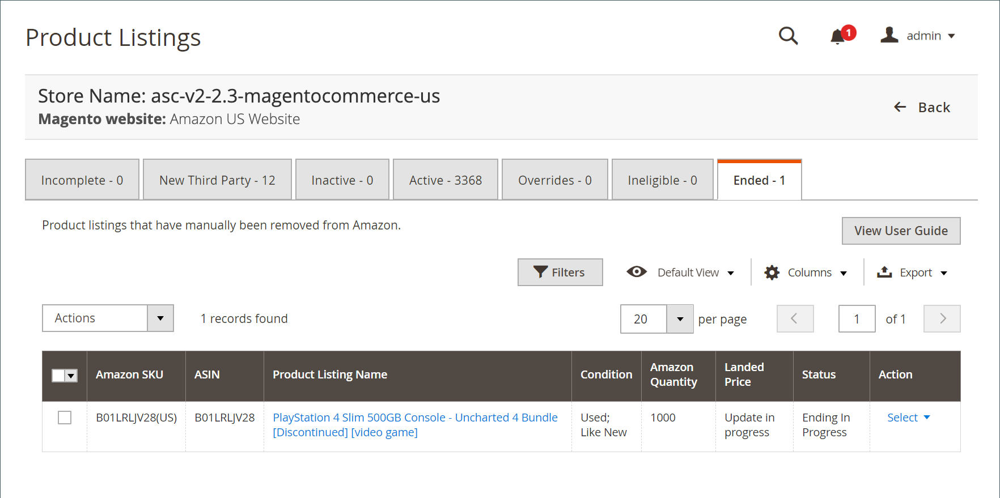

# Eingestellte Listen

Auf der Registerkarte _[!UICONTROL Ended]_werden alle Amazon-Produkte angezeigt, die manuell aus Ihrem [!DNL Amazon Seller Central]-Konto beendet (entfernt) wurden. Diese Produkte erfüllen alle Anforderungen an die Auflistung und können jederzeit erneut veröffentlicht werden und erfordern keine zusätzlichen Informationen. Wenn sich ein Produkt auf der Registerkarte_[!UICONTROL Ineligible]_ befindet, können Sie Ihre [Listeneinstellungen](./listing-settings.md) ändern, sodass Ihr Produkt die Zulassungskriterien erfüllt.

>[!NOTE]
>
>Wenn Listen in Bearbeitung sind, wird die Anzahl der Auflistungen in einer Meldung über den Registerkarten angezeigt.

Unter _[!UICONTROL Actions]_:

- **[!UICONTROL Publish Product to Amazon]**: Wählen Sie aus, die Liste erneut in der  [!DNL Amazon Marketplace]zu veröffentlichen. Siehe [Veröffentlichen einer Amazon-Liste](./publish-listings-manually.md)

Unter **[!UICONTROL Select]** in der Spalte _[!UICONTROL Action]_:

- **[!UICONTROL View Details]**: Wählen Sie aus, ob Sie Details zur Liste anzeigen möchten, darunter das Protokoll zu den  [Listing-Aktivitäten](./product-listing-details.md#listing-activity-log), die  [Buy Box-Preise für Wettbewerber](./product-listing-details.md#buy-box-competitor-pricing) und die Preise für  [Niedrigste Konkurrenz](./product-listing-details.md#lowest-competitor-pricing). Diese Aktion dient nur der Anzeige. In den Listendetails können keine Änderungen vorgenommen werden. Siehe [Details anzeigen](./product-listing-details.md).

- **[!UICONTROL Publish On Amazon]**: Wählen Sie aus, die Liste erneut in der  [!DNL Amazon Marketplace]zu veröffentlichen. Siehe [Veröffentlichen einer Amazon-Liste](./publish-listings-manually.md).

- **[!UICONTROL Create Alias Seller SKU]**: Wählen Sie die Erstellung einer Alias-SKU aus, die zum Erstellen einer Amazon-Liste aus demselben Katalogprodukt verwendet werden kann. Siehe [Alias-Verkäufer-SKU erstellen](./create-alias-seller-sku.md).

Endlisten finden Sie unter [Ende einer Amazon-Auflistung](./end-listings-manually.md).

Informationen zu Veröffentlichungslisten finden Sie unter [Manuelles Veröffentlichen einer Amazon-Liste](./publish-listings-manually.md).

Die Startseiten der Amazon-Vertriebskanäle teilen einige gängige [Arbeitsbereichssteuerelemente](./workspace-controls.md), mit denen Sie die angezeigten Daten anpassen können.

| Spalte | Beschreibung |
|--- |--- |
| [!UICONTROL Amazon Seller SKU] | Die SKU (Stock Keeping Unit, Bestandseinheit), die von Amazon einem Produkt zugewiesen wurde, um das Produkt, die Optionen, den Preis und den Hersteller zu identifizieren. |
| [!UICONTROL ASIN] | Ein eindeutiger Block von 10 Buchstaben und/oder Zahlen zur Identifizierung von Elementen.  ASIN steht für die Amazon Standard-Identifikationsnummern. Ein ASIN ist ein eindeutiger Block von 10 Buchstaben und/oder Zahlen, der Elemente identifiziert. Bei Büchern entspricht das ASIN der ISBN-Nummer, bei allen anderen Produkten wird jedoch beim Hochladen des Artikels in den Katalog ein neues ASIN erstellt. Sie finden einen Artikel-ASIN auf der Produktdetailseite in Amazon sowie weitere Details zum Artikel. |
| [!UICONTROL Product Listing Name] | Der Name des Produkts. |
| [!UICONTROL Condition] | Die [Bedingung](./product-listing-condition.md) des Produkts. |
| [!UICONTROL Landed Price] | Der Börsennotierungspreis für das Produkt zuzüglich des Versandpreises. |
| [!UICONTROL Amazon Quantity] | Die verfügbare Menge, wenn das Produkt aktiv in Amazon aufgeführt wird. |
| [!UICONTROL Status] | Der von Amazon definierte Status der Auflistung. |
| [!UICONTROL Action] | Liste der verfügbaren Aktionen, die auf eine bestimmte Liste angewendet werden können. Um eine Aktion anzuwenden, klicken Sie in der Spalte _[!UICONTROL Action]_auf **[!UICONTROL Select]**und wählen Sie das Element aus:<ul><li>[[!UICONTROL View Details]](./product-listing-details.md)</li><li>[[!UICONTROL Publish On Amazon]](./publish-listings-manually.md)</li><li>[[!UICONTROL Create Alias Seller SKU]](./create-alias-seller-sku.md#region-specific)</li></ul> |
