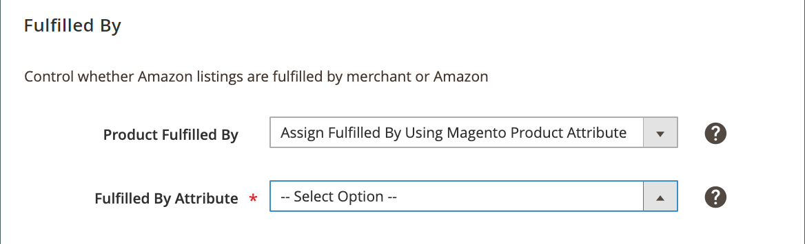

# Erfüllen durch Einstellungen für Amazon-Listen

_[!UICONTROL Fulfilled By]_-Einstellungen sind Teil Ihrer Einstellungen für die Store-Auflistung. Auf die Listening-Einstellungen kann über die [Store-Dashboard](./amazon-store-dashboard.md).

Diese Einstellungen definieren die Partei, die Bestellungen erfüllt (oder ausführt). Wenn alle Ihre Bestellungen mit einer Methode erfüllt sind, wählen Sie zwischen Händler (Sie) oder Amazon. Wenn Sie planen, Bestellungen von Ihren Standorten zu erfüllen und Amazon zu verwenden, empfiehlt es sich, die dritte Option zu verwenden und eine [!DNL Commerce] Produktattribut.

- **[!UICONTROL Fulfilled by Merchant]** - Entscheiden Sie, ob Sie, der Händler, alle Bestellungen erfüllen. Wenn eine Bestellung aufgegeben wird, wird der Bestand von Ihrem [!DNL Commerce] Katalog.

- **[!UICONTROL Fulfilled by Amazon]** - Wählen Sie aus, ob Amazon alle Bestellungen erfüllt. Mit dieser Option wird der Produktbestand nicht von Ihrer [!DNL Commerce] Katalog, wenn eine Bestellung aufgegeben wird. Lagerbestand für von Amazon erfüllte Bestellungen wird gespeichert und von ihren Lagern abgezogen. Bevor Sie diese Option zuweisen, müssen Sie in Ihrem [!DNL Amazon Seller Central] Konto, für das Ihre Produkte berechtigt sind _Erfüllt von Amazon_ (FBA) Erfüllung. FBA-Bestände werden direkt über Ihre [!DNL Amazon Seller Central] Konto. Bei dieser Ausführungsmethode gibt der Amazon-Verkaufskanal keine Mengenaktualisierungen zwischen [!DNL Commerce] und Amazon. Daher stehen Ihnen nicht alle in den Mengeneinstellungen beschriebenen Marketing-Tools im Amazon-Vertriebskanal zur Verfügung.

- **[!UICONTROL Assign Fulfilled By Using Magento Product Attribute]** - Wenn Ihre Produkte von Ihnen und Amazon erfüllt werden können, sollten Sie eine [!DNL Commerce] Produktattribut mit Werten für Fulfill By Merchant und Fulfill by Amazon. Wenn Sie diesen Wert pro Produkt festlegen, wird angegeben, wer die Bestellungen erfüllt.

Die Ausführungsmethode ist ein regionales Attribut und basiert auf der **[!UICONTROL Amazon Marketplace Country]** während der [Store-Integration](./store-integration.md). Wenn eine Änderung vorgenommen wird, wirkt sich die Änderung auf alle Amazon-Listen aus, die diese [!DNL Amazon Seller SKU] in Ihren Amazon-Stores, die in derselben Region verkauft werden (wie in _[!UICONTROL Amazon Marketplace Country]_during [Store-Integration](./store-integration.md)). Änderung an freigegebenen [!DNL Amazon Seller SKU] in den USA hat keine Auswirkungen auf Ihre Amazon-Stores, die für eine andere Region festgelegt wurden (wie bei der Store-Integration definiert).

>[!NOTE]
>
>Wenn eine Bestellung von Amazon (FBA) erfüllt wird und die Bestellung importiert wird, können Sie Platzhalterdaten für einige Felder in den Bestelldetails sehen. Siehe [Amazon-Bestelldetails](./amazon-order-details.md).

## Konfigurieren Sie die [!UICONTROL Fulfilled By] settings {#configure-fulfilled-by-settings}

1. Klicken **[!UICONTROL Listing Settings]** im Dashboard speichern.

1. Erweitern Sie die _[!UICONTROL Fulfilled By]_Abschnitt.

1. Für **[!UICONTROL Product Fulfilled By]** auswählen, wer die Bestellung erfüllt (Schiffe):

   - `Fulfilled by Merchant` - Der Händler erfüllt die Bestellung.

   - `Fulfilled by Amazon` - Amazon Warehouse erfüllt die Bestellung.

   - `Assign Fulfilled By Using Magento Product Attribute` - A [!DNL Commerce] gibt an, wer die Bestellung pro Produkt erfüllt.

      Wählen Sie, falls ausgewählt, die [!DNL Commerce] -Attribut, das Sie zuordnen möchten **[!UICONTROL Fulfilled by Attribute]**.

1. Wenn Sie fertig sind, klicken Sie auf **[!UICONTROL Save listing settings]**.

{width="500" zoomable="yes"}

| Feld | Beschreibung |
|--- |--- |
| [!UICONTROL Product Fulfilled By] | Optionen:<ul><li>**[!UICONTROL Fulfilled by Merchant]** - (FBM) Wählen Sie aus, ob Sie die Bestellungen erfüllen. Wenn eine Bestellung aufgegeben wird, wird der Bestand von Ihrem [!DNL Commerce] Katalog. Wenn ein neues Produkt erstellt wird, wird die Ausführungsmethode von Merchant Fulfill zugewiesen.</li><li>**[!UICONTROL Fulfilled by Amazon]** - (FBA) Entscheiden Sie, ob Amazon die Bestellungen erfüllt. Mit dieser Erfüllungsmethode wird der Produktbestand nicht von Ihrer [!DNL Commerce] Katalog, wenn eine Bestellung aufgegeben wird. Wenn ein Produkt erstellt wird, wird es mit _[!UICONTROL Fulfilled by Amazon (FBA)]_als Erfüllungstyp. Stellen Sie sicher, dass Ihre Produkte innerhalb Ihrer [!DNL Amazon Seller Central] -Konto. FBA-Bestände werden auch direkt über Ihre [!DNL Amazon Seller Central] -Konto. Bei dieser Ausführungsmethode werden Mengenaktualisierungen nicht relativ zu Ihrer [!DNL Commerce] -Katalog, sodass Sie einige der unter [Lager-/Quantitätseinstellungen](./stock-quantity.md).</li><li>**[!UICONTROL Assign Fulfilled By Using Magento Product Attribute]** - Wählen Sie aus, ob Sie bereits [!DNL Commerce] -Attribut, das bestimmt, ob der Händler es erfüllt oder von Amazon erfüllt hat. Wenn ausgewählt, **[!UICONTROL Fulfilled by Attribute]** aktiviert.</li></ul> |
| [!UICONTROL Fulfilled By Attribute] | Wählen Sie die [!DNL Commerce] -Attribut, das zur Bestimmung der Ausführungsmethode verwendet wird.  Wenn das Attribut beispielsweise _Erfüllt von_ und Sie wählen den Attributwert als `Fulfilled By Merchant` oder `Fulfilled By Amazon (FBA)`verwendet das System diesen Wert als Erfüllungstyp für ein neues Produkt. Als Händler sollten Sie sicherstellen, dass Ihre Produkte innerhalb Ihrer [!DNL Amazon Seller Central] -Konto. FBA Inventory wird auch direkt über Ihr Amazon-Verkaufskonto verwaltet.  Die Optionen hängen von den Attributen ab, die Sie für Ihre Amazon-Produkte einrichten. |

**Schnellzugriff** - [!UICONTROL Listing Settings] Abschnitte

- [[!UICONTROL Product Listing Actions]](./product-listing-actions.md)
- [[!UICONTROL Third Party Listings]](./third-party-listing-settings.md)
- [[!UICONTROL Listing Price]](./listing-price.md)
- [[!UICONTROL (B2B) Business Price]](./business-pricing.md)
- [[!UICONTROL Stock / Quantity]](./stock-quantity.md)
- [[!UICONTROL Fulfilled By]](./fulfilled-by.md)
- [[!UICONTROL Catalog Search]](./catalog-search.md)
- [[!UICONTROL Product Listing Condition]](./product-listing-condition.md)
