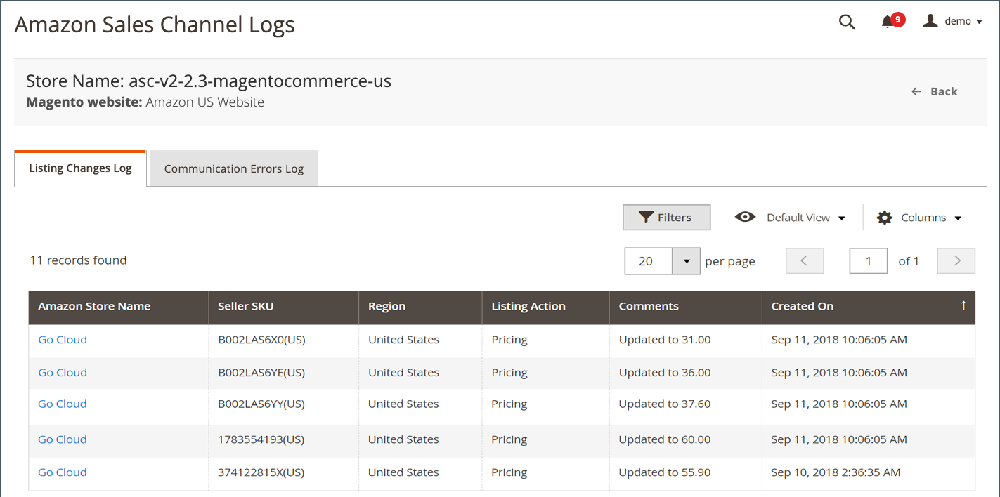

# [!UICONTROL Listing Changes Log]

Das Protokoll zu den Listenänderungen zeigt die Änderungen an, die in Ihrer [!DNL Amazon Seller Account] als Spiegelbild Ihrer Amazon-Vertriebskanaleinstellungen. Dieses Protokoll zeigt die globalen Änderungen an, die zwischen dem Amazon- und Amazon-Vertriebskanal synchronisiert wurden. Dieses Protokoll enthält Änderungen an einer Produkt-SKU, z. B. den Aktionstyp (Änderung), eine kurze Beschreibung der Änderung und das Datum der Änderung.

Für das Protokoll sind keine Aktionen verfügbar. Es handelt sich um eine Funktion, die nur zur Überprüfung dient.

Die Startseiten der Amazon-Vertriebskanäle teilen sich einige gemeinsame [Arbeitsbereichssteuerelemente](./workspace-controls.md) die es Ihnen ermöglichen, die angezeigten Daten anzupassen.

{width="600" zoomable="yes"}

## Standardspalten

| Spalte | Beschreibung |
|--------------------------------|-------------------------------------------------------------------------------------------------------------------------|
| [!UICONTROL Amazon Store Name] | Der Name des Stores, der beim Einrichten des Amazon-Stores definiert wurde. Siehe [Store-Integration](./store-integration.md). |
| [!UICONTROL Seller SKU] | Die SKU (Stock Keeping Unit, Bestandseinheit), die von Amazon einem Produkt zugewiesen wurde, um das Produkt, die Optionen, den Preis und den Hersteller zu identifizieren. |
| [!UICONTROL Listing Action] | Die Art der Änderung, die an der Auflistung vorgenommen wurde. |
| [!UICONTROL Comments] | Zusätzliche Informationen zur Änderung der Auflistung. |
| [!UICONTROL Created On] | Datum und Uhrzeit der Änderung. |
