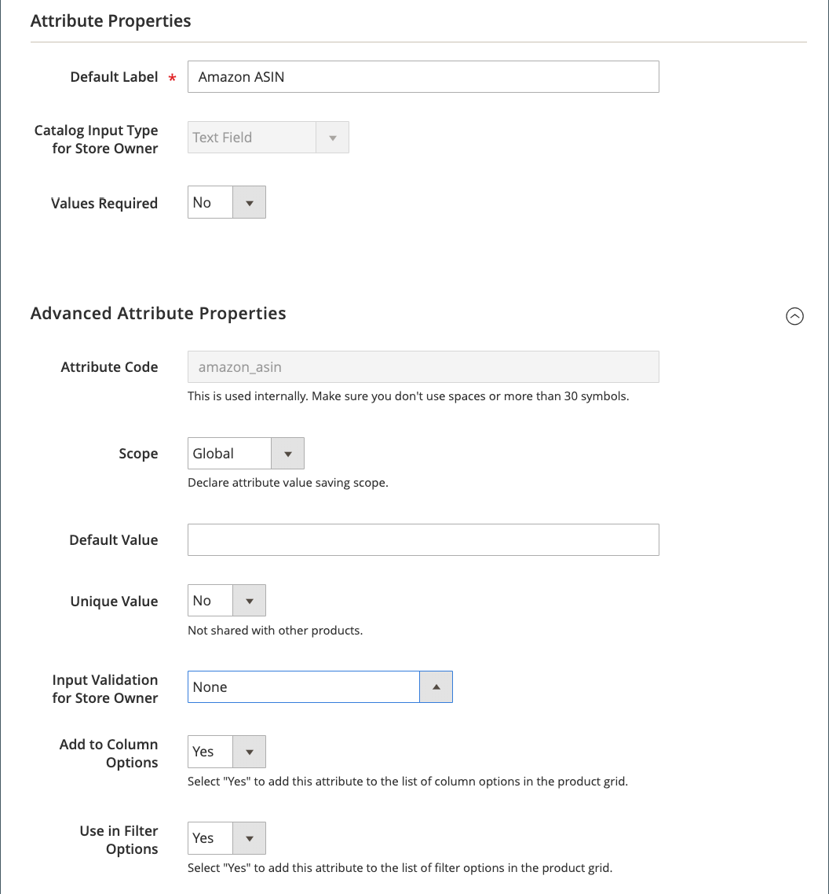

# Erstellen von Commerce-Attributen für Amazon

Vor der Onboarding-Arbeit [!DNL Amazon Seller Central] , empfiehlt es sich, [!DNL Commerce] [Produktattribute](https://experienceleague.adobe.com/docs/commerce-admin/catalog/product-attributes/product-attributes.html) , um Ihre Produktlisten zuzuordnen. Nach Abschluss des Onboarding können Sie Ihre Produktattribute über die [Attribute](./managing-attributes.md) des [Amazon-Vertriebskanal - Startseite](./amazon-sales-channel-home.md) Seite.

In diesen Anweisungen wird beschrieben, wie Sie [!DNL Commerce] -Attribute für Amazon ASIN- und Amazon-Bedingung. Es wird empfohlen, zusätzliche Attribute wie Amazon EAN, Amazon ISBN und Amazon UPC zu erstellen. Sie können auch ein Amazon-Preisattribut erstellen, wenn Sie Ihren Amazon-Listingpreis als Preisquelle für Preisregeln verwenden möchten. Diese Attribute werden bei der Konfiguration Ihrer Listen- und Preiseinstellungen beim Onboarding verwendet. Verwenden Sie diese Attribute auch beim Erstellen von Amazon-Listen und beim Aktualisieren und Synchronisieren Ihrer [!DNL Commerce] Katalog mit Ihren Amazon-Auflistungen.

Einstellungen für die Katalogsuche ermöglichen es Ihnen, übereinstimmende Suchparameter festzulegen, die bei der Zuordnung der geeigneten [!DNL Commerce] Produkte mit Amazon-Listen. Sofern zugeordnet, aktiviert Amazon Aktionen im Zusammenhang mit Preisen, Menge, Außerkraftsetzungen sowie der Bestell- und Produktsynchronisierung.

Die Definition dieser Werte erhöht das Potenzial für exakte Übereinstimmungen, wodurch die Notwendigkeit einer manuellen Zuordnung von Produktlisten zu einem späteren Zeitpunkt minimiert wird. Hinzufügen der Attribute im Rahmen des Onboarding [Aufgaben vor der Einrichtung](./amazon-pre-setup-tasks.md)bietet der Amazon-Vertriebskanal ein höheres Potenzial, Ihre Produkte beim Onboarding automatisch abzugleichen und die Produktdaten zwischen Amazon und zu synchronisieren. [!DNL Commerce] nach dem Onboarding.

Wenn Sie nur das Amazon-ASIN-Attribut erstellen (ohne ASIN-Werte pro Produkt hinzuzufügen), wird Ihre [!DNL Commerce] -Produkte stimmen möglicherweise nicht automatisch mit Ihren Amazon-Listen überein. Sie können Ihre Produkte manuell über _Store-Überprüfung_. Beim manuellen Abgleich werden jedoch nicht die Datenelemente erstellt, die zum Freigeben und Synchronisieren Ihrer Produktdaten erforderlich sind.

>[!IMPORTANT]
>
>Wenn Sie ein ASIN-, UPC- oder anderes Datenelement für ein manuell übereinstimmendes Produkt aktualisieren, müssen Sie die Daten an beiden Stellen aktualisieren: in Ihrer [!DNL Commerce] Katalog und die Auflistung in [!DNL Amazon Seller Central] -Konto.

## Amazon ASIN-Produktattribut erstellen

1. Melden Sie sich bei [!DNL Commerce] Admin.

1. Klicks **[!UICONTROL Stores]** im Menü links.

1. Im _[!UICONTROL Attributes]_Abschnitt, klicken Sie auf **[!UICONTROL Product]**.

1. Um die Attributeigenschaften zu öffnen, klicken Sie auf **[!UICONTROL Add New Attribute]**.

1. Für **[!UICONTROL Default Label]**, eingeben `Amazon ASIN` (der Name Ihres Attributs).

1. Für **[!UICONTROL Catalog Input Type for Store Owner]** auswählen `Text Field`.

1. Für **[!UICONTROL Values Required]** auswählen `No`.

   Obwohl ein Amazon-ASIN erforderlich ist, um ein Produkt in Amazon aufzulisten, werden einige Ihrer Katalogprodukte möglicherweise nicht in Amazon aufgeführt.

1. Erweitern Sie die _[!UICONTROL Advanced Attribute Properties]_und legen Sie die Optionen fest:

   - Für **[!UICONTROL Attribute Code]**, eingeben `amazon_asin`.

   - Für **[!UICONTROL Scope]** auswählen `Global`.

   - Für **[!UICONTROL Unique Value]** auswählen `No`.

   - Für **[!UICONTROL Input Validation for Store Owner]** auswählen `None`.

   - Für **[!UICONTROL Add to Column Options]** auswählen `Yes`.

   - Für **[!UICONTROL Use in Filter Options]** auswählen `Yes`.

1. Klicken **[!UICONTROL Save Attribute]**.

{width="600" zoomable="yes"}

## Erstellen des Amazon-Bedingungs-Produktattributs

1. Melden Sie sich bei [!DNL Commerce] Admin.

1. Klicks **[!UICONTROL Stores]** im Menü links.

1. Im _[!UICONTROL Attributes]_Abschnitt, klicken Sie auf **[!UICONTROL Product]**.

1. Um die Attributeigenschaften zu öffnen, klicken Sie auf **[!UICONTROL Add New Attribute]**.

1. Für **[!UICONTROL Default Label]**, eingeben `Amazon Condition` (der Name Ihres Attributs).

1. Für **[!UICONTROL Catalog Input Type for Store Owner]** auswählen `Dropdown`.

   Die _[!UICONTROL Manage Options (Values of your Attribute)]_angezeigt.

1. Für **[!UICONTROL Values Required]** auswählen `No`.

1. Für **[!UICONTROL Manage Options (Values for your Attribute)]**, fügen Sie jede Ihrer Bedingungsoptionen hinzu.

   Zu den standardmäßigen Amazon-Bedingungen gehören:

   - `New: Refurbished: Used`
   - `Like New: Used`
   - `Very Good: Used`
   - `Good: Used`
   - `Acceptable: Collectible`
   - `Like New; Collectible`
   - `Very Good: Collectible`
   - `Good: Collectible; Acceptable`

1. Klicken **[!UICONTROL Add Option]**.

1. Wählen Sie die **[!UICONTROL Is Default]** -Option für die Bedingung, die Sie als Standardauswahl festlegen möchten.

1. Im _[!UICONTROL Admin]_den Text für den Titel der hinzuzufügenden Bedingung (z. B. `New`, `Used`, und `Used-Like New`)

1. Klicks **[!UICONTROL Add Option]** , um bei Bedarf weitere Optionen hinzuzufügen.

1. Erweitern _[!UICONTROL Advanced Attribute Properties]_und legen Sie die Optionen fest.

   - Für **[!UICONTROL Attribute Code]**, eingeben `amazon_condition`.

   - Für **[!UICONTROL Scope]** auswählen `Global`.

   - Für **[!UICONTROL Unique Value]** auswählen `No`.

   - Für **[!UICONTROL Input Validation for Store Owner]** auswählen `None`.

   - Für **[!UICONTROL Add to Column Options]** auswählen `Yes`.

   - Für **[!UICONTROL Use in Filter Options]** auswählen `Yes`.

1. Klicken **[!UICONTROL Save Attribute]**.

{width="600" zoomable="yes"}

 [**API-Schlüssel weiterhin hinzufügen oder überprüfen**](./amazon-verify-api-key.md)
