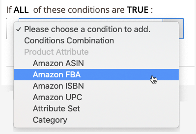

# Beispiel: Bedingung definieren

## Bedingungen

Auf alle Bereiche in den fett gedruckten Bedingungen kann geklickt werden, um die verschiedenen Optionen anzuzeigen.

**Fügen Sie keine Bedingungen hinzu, wenn alle Produkte auf der ausgewählten Website förderfähig sind.**

>[!NOTE]
>
>Es gibt eine komplexe Reihe von Back-End-Prozessen, die direkt mit den Systemen von Amazon kommunizieren. Je nachdem, wie viele Elemente Sie auflisten möchten und wie beschäftigt die Amazon-Systeme sein könnten (z. B. Black Friday), kann es einige Zeit dauern, bis Ihre Artikel in Amazon aufgelistet werden.

Siehe Abschnitt &quot;Bedingungen&quot;von [Erstellen einer Preisregel für Warenkorb](https://experienceleague.adobe.com/docs/commerce-admin/marketing/promotions/catalog-rules/price-rules-catalog-create.html).

## Bedingung definieren

Dieser Vorgang kann je nach Katalogeinrichtung einfach oder detailliert sein. Sie können Ihre Bedingungen so einrichten, dass `ALL` oder `ANY` der definierten Bedingungen `TRUE` oder `FALSE` für ein Produkt, ist das Produkt berechtigt, in Amazon aufgeführt zu werden.

Bedingungen basieren auf vorhandenen Produktattributwerten. Lassen Sie den Abschnitt Bedingungen leer, um die Regel auf alle Produkte anzuwenden.

>[!NOTE]
>
>Wenn Sie eine Bedingung basierend auf einem bestimmten Produktattribut definieren möchten, legen Sie die **[!UICONTROL Use for Promo Rule Conditions]** Einstellung für das Attribut `Yes`. Sie können auf diese Einstellung im [Storefront-Eigenschaften](https://experienceleague.adobe.com/docs/commerce-admin/catalog/product-attributes/product-attributes-add.html) -Seite für das -Attribut.

{width="500"}

Die Regel in diesem Beispiel definiert eine Regel, die die Amazon-Berechtigung für alle Katalogprodukte mit der Variablen _Amazon FBA_ -Attribut auf `Yes`.

Die Regelanweisung enthält zwei fette Links, die beim Klicken die Optionen für diesen Teil der Anweisung anzeigen. Wenn Sie die Bedingung speichern, ohne eine fett gedruckte Option zu ändern, gilt die Regel für alle Ihre Produkte.

- Klicken **[!UICONTROL ALL]** und wählen Sie entweder `ALL` oder `ANY`.
- Klicken **[!UICONTROL TRUE]** und wählen Sie entweder `TRUE` oder `FALSE`.
- Um die Regel auf alle Produkte anzuwenden, lassen Sie die Bedingung unverändert.

Sie können unterschiedliche Bedingungen erstellen, indem Sie die Kombination dieser Werte ändern. Für dieses Beispiel wird die folgende Bedingung verwendet:

`If ALL of these conditions are TRUE:`

1. Klicken Sie auf Hinzufügen () am Anfang der Bedingungszeile und wählen Sie ein Attribut aus, auf dem die Bedingung basieren soll, z. B. eine Bedingungskombination oder ein Produktattribut.

   - **[!UICONTROL Conditions Combination]** - Ermöglicht die Erstellung eines weiteren Satzes von `All/Any` und `True/False` Bedingungen innerhalb des vorhandenen Satzes.

      {width="500"}

   - **[!UICONTROL Product Attribute]** - Die Produktattribute hängen von der Einrichtung des Attributs ab. Damit ein Attribut in der Liste angezeigt wird, muss es für die Verwendung in Bedingungen für Werberegeln konfiguriert werden. Siehe _Verwendung für Bedingungen für Angebotsregeln_ in [Produktattribute](https://experienceleague.adobe.com/docs/commerce-admin/catalog/product-attributes/product-attributes.html).

      In der Liste unter **[!UICONTROL Product Attribute]**, wählen Sie das Attribut aus, das Sie als Grundlage für die Bedingung verwenden möchten. In diesem Beispiel lautet die ausgewählte Bedingung: `Amazon FBA`.

      {width="350"}

      Die ausgewählte Bedingung wird in der Anweisung angezeigt, gefolgt von zwei weiteren fett gedruckten Links. Die Optionen variieren je nach ausgewähltem Produktattribut.

      Nachdem Sie das Attribut festgelegt haben, kann es nicht mehr geändert werden. Um das Attribut zu ändern, müssen Sie die Zeile löschen und das neue Attribut hinzufügen. Sie können eine Bedingungszeile löschen, indem Sie auf Löschen () am Ende der Zeile.

      1. Klicken **[!UICONTROL is]** und wählen Sie den Vergleichsoperator aus, der die Bedingung für die zu erfüllenden Produkte beschreibt.

         In diesem Beispiel lautet der Vergleichsoperator `is`. Die verfügbaren Optionen hängen vom im vorherigen Schritt ausgewählten Attribut ab. Optionen können verschiedene Vergleichsoptionen umfassen, z. B. übereinstimmende Werte, die mindestens einen Wert nicht enthalten oder darunter stehen, sowie größer, gleich und kleiner als ein numerischer Wert. In diesem Beispiel sind die Optionen `is` und `is not`.

      1. Klicken **[!UICONTROL ...]** und wählen Sie den Attributwert aus, auf dem die Bedingung basiert.

         Die Optionen hängen von der Einrichtung des Attributs ab. Sie werden möglicherweise aufgefordert, eine Option auszuwählen oder Text- oder Zahlenwerte für die Bedingung einzugeben. In diesem Beispiel lautet die Auswahl `Yes`.

         Das ausgewählte Element wird in der Anweisung angezeigt, um die Bedingung abzuschließen.

         {width="500"}
   Diese Bedingung ist abgeschlossen. Wie angegeben bedeutet diese Bedingung, dass jedes Produkt in Ihrer [!DNL Commerce] Katalog, für den das Amazon FBA-Attribut auf den Wert `Yes` ist für die Aufnahme in Amazon für die Region und den Store qualifiziert. Sie können weitere Bedingungszeilen hinzufügen, um Ihre infrage kommenden Produkte weiter einzuschränken.

1. Um der Anweisung eine weitere Bedingungszeile hinzuzufügen, kehren Sie zu Schritt 1 zurück und wiederholen Sie den Prozess, bis alle gewünschten Bedingungen abgeschlossen sind.

Sie können eine Zeile der Bedingungsanweisung jederzeit löschen, indem Sie auf Löschen () am Ende der Zeile.
