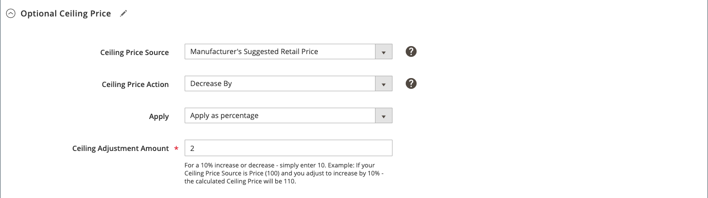

# Intelligente Preisanpassungsregel: fakultativer Höchstpreis

Zu den Abschnitten einer intelligenten Neubewertungsregel gehören:

- [Regeltyp auswählen](./intelligent-repricing-rules.md)
- [Bedingte Abweichungen des Konkurrenten](./competitor-conditional-variances.md)
- [Preisanpassung](./price-adjustment.md)
- [Floor-Preis](./floor-price.md)
- Optionaler Höchstpreis

Die automatisierten Preisobergrenzen schützen automatisch Ihren höchsten Produktpreis vor intelligenten Preisregeln und ermöglichen es Ihnen, einen Höchstpreis für Ihre intelligenten Preisregeln festzulegen.

## Optionaler Höchstpreis konfigurieren

Definieren Sie die optionalen höchsten Preiseinstellungen im _[!UICONTROL Optional Ceiling Price]_Abschnitt.

1. für **[!UICONTROL Ceiling Price Source]**, wählen Sie ein Attribut aus.

   Wählen Sie [!DNL Commerce] [Produktattribut](https://docs.magento.com/user-guide/catalog/product-attributes.html){Zielgruppe=&quot;_blank&quot;}, die Ihre relative Höchstgrenze angibt. Wenn Sie z. B. nicht möchten, dass Ihr Amazon-Listungspreis über den MSRP Ihres Artikels liegt, wählen Sie `Manufacturer's Suggested Retail Price` Attribut.

1. für **[!UICONTROL Ceiling Price Action]**, wählen Sie eine Option aus.

   - `Decrease By` - Wählen Sie aus, wann die _[!UICONTROL Ceiling Price Source]_-Wert nach unten anzupassen, um einen niedrigeren Höchstpreis für die Regel zu schaffen, bevor sie an Amazon notiert wird.

   - `Increase By` - Wählen Sie aus, wann die _[!UICONTROL Ceiling Price Source]_Wert, der angepasst werden muss, um einen höheren Höchstpreis für die Regel zu erzielen, bevor sie an Amazon notiert wird.

   - `Match` - Wählen Sie aus, wenn der Börsennotierungspreis nicht über dem definierten Wert schwanken soll _[!UICONTROL Ceiling Price Source]_Wert. Wenn festgelegt auf `Match`,_[!UICONTROL Apply]_ und _[!UICONTROL Ceiling Adjustment Amount]_Felder sind deaktiviert.

1. Verlassen Sie die **[!UICONTROL Apply]** default as `Apply as percentage`.

1. für **[!UICONTROL Ceiling Adjustment Price]**, geben Sie den numerischen Wert für den Prozentwert ein, um Ihre _[!UICONTROL Ceiling Price Source]_Wert.

In diesem Beispiel wird der Höchstpreis auf 2 % unter dem MSR des Artikels festgesetzt.

| Feld | Beschreibung |
|---|---|
| [!UICONTROL Ceiling Price Source] | Wählen Sie [!DNL Commerce] [Produktattribut](https://docs.magento.com/user-guide/catalog/product-attributes.html){Zielgruppe=&quot;_blank&quot;}, die Ihre relative Höchstgrenze angibt. Wenn Sie z. B. nicht möchten, dass Ihr Produktlistungspreis über den MSRP Ihres Artikels liegt, wählen Sie `Manufacturer's Suggested Retail Price` Attribut. |
| [!UICONTROL Ceiling Price Action] | Wählen Sie eine Preisanpassungsaktion aus. Optionen:<ul><li>**[!UICONTROL Decrease By]** - Wählen Sie aus, wann die _[!UICONTROL Ceiling Price Source]_-Wert nach unten anzupassen, um einen niedrigeren Höchstpreis für die Regel zu schaffen, bevor sie an Amazon notiert wird.</li><li>**[!UICONTROL Increase By]** - Wählen Sie aus, wann die _[!UICONTROL Ceiling Price Source]_Wert, der angepasst werden muss, um einen höheren Höchstpreis für die Regel zu erzielen, bevor sie an Amazon notiert wird.</li><li>**[!UICONTROL Match]** - Wählen Sie aus, wenn der Börsennotierungspreis nicht über dem definierten Wert schwanken soll _[!UICONTROL Ceiling Price Source]_Wert. Wenn festgelegt auf `Match`,_[!UICONTROL Apply]_ und _[!UICONTROL Ceiling Adjustment Amount]_Felder sind deaktiviert.</li></ul> |
| [!UICONTROL Apply] | **[!UICONTROL Apply as percentage]** - Eine prozentuale Anpassung in Bezug auf _[!UICONTROL Ceiling Price Source]_Wert. |
| [!UICONTROL Ceiling Price Adjustment] | Geben Sie den numerischen Wert für den Prozentwert ein, um Ihre _[!UICONTROL Ceiling Price Source]_Wert. |
