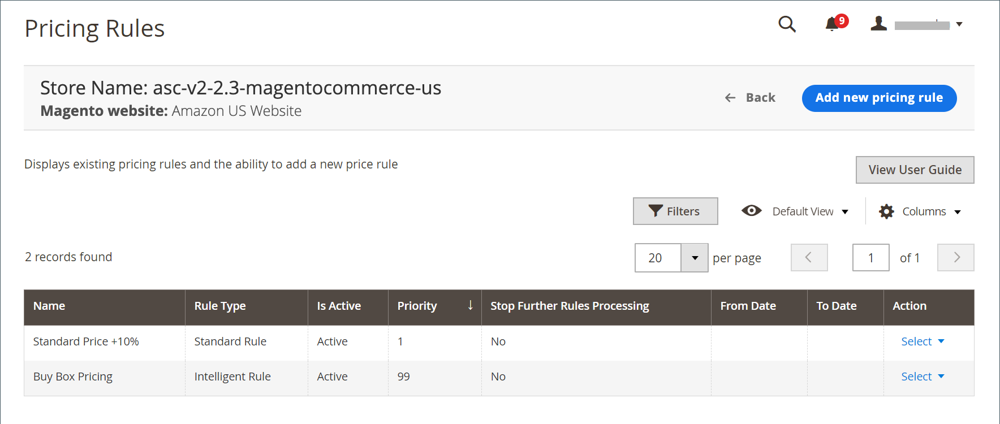

# Amazon-Preise verwalten

Mit dem Amazon-Vertriebskanal können Sie Preisregeln festlegen, mit denen Sie Ihren Amazon-Börsennotierungspreis festlegen können, der sich von dem definierten **[!UICONTROL Magento Price Source]** in Ihrem [Auflistungspreis](./listing-price.md) unterscheidet. Sie können auch mehrere Regeln stapeln und sogar die intelligente Preisgestaltung verwenden, um Ihren Amazon-Listenpreis auf Grundlage des [[!DNL Buy Box]](./buy-box-competitor-pricing.md)-Preises Ihrer Konkurrenten oder des [niedrigsten Konkurrenzpreises](./lowest-competitor-pricing.md) anzupassen.

Es gibt zwei Arten von Preisregeln:

- [Standardmäßige Preisregel](./standard-price-rules.md)
- [Intelligente Neupreisregel](./intelligent-repricing-rules.md)

   >[!IMPORTANT]
   >
   >Intelligente Neupreisregeln funktionieren nicht ordnungsgemäß, wenn der Amazon-Bereich auf den Status `Inactive` gesetzt ist, wie dies beim Onboarding der Fall ist. Ihre Preisberechnungen hängen von Ihren Versandtarifen ab und Ihre Region muss den Status `Active` aufweisen, damit Ihre Versandraten von Amazon synchronisiert werden.
   >
   >Um den Status Ihrer Region in Ihrem Amazon-Konto zu aktualisieren, gehen Sie zu Einstellungen > Kontoinformationen > Urlaubseinstellungen. Siehe [Amazon: Listing Status for Vacations](https://sellercentral.amazon.com/gp/help/help.html?itemID=200135620){:target=&quot;_blank&quot;} (Anmeldung von Seller Central erforderlich).

Mit dieser Funktion können Sie Ihre Amazon-Preise auf eine ähnliche Weise bearbeiten wie die [!DNL Commerce] [Katalogpreisregeln](https://docs.magento.com/user-guide/catalog/pricing.html){:target=&quot;_blank&quot;}. Sie können komplexe Regeln erstellen, mit denen Sie die Preise für bestimmte Produkte, Produkte innerhalb bestimmter Kategorien oder auch mit bestimmten Attributen ändern können.

Sie können Preisregeln für Ihre Amazon-Listen hinzufügen. Mit Preisregeln können Sie Ihre Listenpreise anhand einer Reihe definierter Bedingungen automatisch anpassen. Preisregeln werden ausgelöst und berechnen Ihren angepassten Preis, bevor Ihr Produkt in Amazon aufgeführt wird.

>[!NOTE]
>
>Die Preisquelle für Ihre Amazon-Auflistungen wird für **[!UICONTROL Magento Price Source]** in den Einstellungen [Auflistungspreis](./listing-price.md) definiert. Alle in der Preisregel definierten Anpassungsberechnungen verwenden die Preisquelle als Startwert.

Mit Preisregeln können Sie in Ihren Einstellungen für [Auflistungspreis](./listing-price.md) den Amazon-Auflistungspreis von **[!UICONTROL Magento Price Source]** unterscheiden. Sie können auch mehrere Regeln stapeln, die zusammenarbeiten, um Ihren Preis anzupassen.

Eine Preis-/Preisänderungsregel erfordert während der Einrichtung drei Informationssätze:

- [Allgemeine Einstellungen](./pricing-rule-general-settings.md): Definiert den Namen, die Beschreibung, das aktive Datum und die Priorität für eine Regel und legt das Verhalten nachfolgender Regeln basierend auf ihrer Prioritätseinstellung fest.
- [Bedingungen](./pricing-rule-conditions.md): Bestimmen Sie, welche Produkte für die Preisregel infrage kommen.
- [Aktionen](./pricing-rule-actions.md): Definieren Sie die auf die Preisquelle angewendeten Anpassungsberechnungen zur Bestimmung des Börsenkurses.

Sie können [Standard-Preisregeln](./standard-price-rules.md) erstellen, die Ihren Amazon-Listenpreis in den Einstellungen [Listenpreis](./listing-price.md) automatisch an den ausgewählten **[!UICONTROL Magento Price Source]** anpassen. Mit dieser Funktion können Sie Ihre Amazon-Preise auf eine ähnliche Weise bearbeiten wie die [!DNL Commerce] [Katalogpreisregeln](https://docs.magento.com/user-guide/marketing/price-rules-catalog.html){:target=&quot;_blank&quot;}. Sie können komplexe Regeln erstellen, die die Preise für bestimmte Produkte, Produkte innerhalb bestimmter Kategorien oder Produkte mit bestimmten Attributen automatisch ändern. Sie können traditionelle Einstellungen vornehmen und Ihre Produkte neu berechnen, um sie basierend auf einem festen Betrag oder Prozentsatz zu erhöhen oder zu verringern.

Ein weiteres leistungsstarkes Tool ist die Funktion [Intelligent Reprice](./intelligent-repricing-rules.md) , mit der Sie Ihren Amazon-Listenpreis auf Grundlage des Preises von Konkurrenten [[!DNL Buy Box]](./buy-box-competitor-pricing.md) oder [Niedrigster Konkurrenzpreis](./lowest-competitor-pricing.md) anpassen können. Ähnlich wie bei [!DNL Commerce] [Katalogpreisregeln](https://docs.magento.com/user-guide/marketing/price-rules-catalog.html){:target=&quot;_blank&quot;} können Sie mit dieser erweiterten Funktion Ihre Amazon-Preise durch Erstellung komplexer Regeln ändern. Regeln können den Umfang einer Preisänderung für bestimmte Produkte, Produkte innerhalb bestimmter Kategorien oder auch mit bestimmten Produktattributen definieren.

Die intelligente Neuberechnung zur Anpassung Ihrer Amazon-Listenpreise auf der Grundlage der Preise des Konkurrenten. Amazon Sales Channel verfügt über integrierte Schutzmechanismen, mit denen Sie die Spannen schützen oder verhindern können, dass die Preise eines Händlers mit geringem Feedback abgeglichen werden. Mithilfe von [intelligenten Neupreisregeln](./intelligent-repricing-rules.md) können die Listenpreise in Amazon automatisch als fester oder prozentualer Betrag (nach oben oder unten) oder sogar mit dem [[!DNL Buy Box]](./buy-box-competitor-pricing.md)-Preis oder [Niedrigster Konkurrenzpreis](./lowest-competitor-pricing.md) auf Artikelbasis synchronisiert werden. Regeln können sogar gestapelt werden, um eine unbegrenzte Flexibilität zu bieten.

Sie können wichtige Aspekte von Regeln steuern, z. B. den aktiven/inaktiven Status, die Website-Eignung, optionale Datumsbereiche und optionale Prioritätsstufen (für die Regelstapelung verwendet).

Sie können beispielsweise die Bedingungen für eine Preisregel definieren und festlegen, die, wenn die Bedingungen erfüllt sind, automatisch Ihren Listenpreis ändert, bevor er an Amazon gesendet wird.

Eine weitere Preisoption ist ein [Preisüberschreibungen](./overrides.md), der auf der Ebene der einzelnen Listen festgelegt wird. Es kann eine [Preisüberschreibungen](./overrides.md) festgelegt werden. Eine Außerkraftsetzung ignoriert/hat Vorrang vor allen anderen Standardeinstellungen, Einstellungen und Regeln. Eine [override](./overrides.md) kann für Preis, Bearbeitungszeit, Bedingung und Verkaufshinweise festgelegt werden (mit einigen Ausnahmen).

## Standardspalten

| Spalte | Beschreibung |
|---|---|
| [!UICONTROL Name] | Der Name der Preisregel, wie unter [Allgemeine Preisregel-Einstellungen](./pricing-rule-general-settings.md) festgelegt. |
| [!UICONTROL Rule Type] | Der Regeltyp, wie in [Preisregelaktionen](./pricing-rule-actions.md) festgelegt (entweder Standardpreisregel oder Intelligente Neupreisregel) |
| [!UICONTROL Is Active] | Ob die Regel aktiv ist, wie in [Allgemeine Preisregel-Einstellungen](./pricing-rule-general-settings.md) festgelegt |
| [!UICONTROL Priority] | Die Priorität gegenüber anderen Preisbedingungen, wie unter [Allgemeine Preisregeleinstellungen](./pricing-rule-general-settings.md) festgelegt. |
| [!UICONTROL Stop Further Rules Processing] | Gibt an, ob weitere Preisregeln für Produkte verarbeitet werden, die für diese Regel infrage kommen, wie in [Allgemeine Einstellungen der Preisregel](./pricing-rule-general-settings.md) festgelegt |
| [!UICONTROL From Date] | Der Anfang des Zeitraums, in dem die Regel aktiv ist |
| [!UICONTROL To Date] | Das Ende des Zeitraums, in dem die Regel aktiv ist |
| [!UICONTROL Action] | Listet alle Aktionen auf, die auf eine bestimmte Liste angewendet werden können. Um eine Aktion anzuwenden, klicken Sie in der Spalte _[!UICONTROL Action]_auf **[!UICONTROL Select]**. Optionen: `Edit Price Rule` / `Delete Price Rule` |
