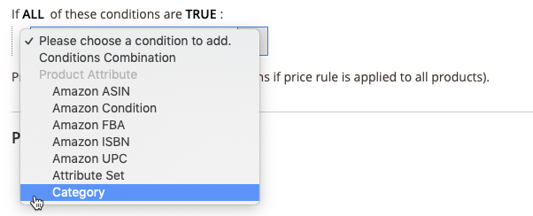

# Preisregel - Bedingungen

Die Bedingungen bestimmen, welche Erzeugnisse für die Preisregel in Betracht kommen. Die Festlegung der Bedingungen für Ihre Amazon-Preisregeln folgt derselben Logik und demselben Verfahren wie die Festlegung der Bedingungen für die Festlegung [Regeln für Warenkorb-Preise](https://docs.magento.com/user-guide/marketing/price-rules-cart.html){Zielgruppe=&quot;_blank&quot;} in [!DNL Commerce].

>[!IMPORTANT]
>
>Wenn Ihre Preisregel für alle Produkte in Ihrer [!DNL Commerce] Katalog, und lassen Sie diesen Abschnitt leer.

Alle Bereiche in den Bedingungen, die fett sind, können angeklickt werden, um die verschiedenen Optionen zu sehen.

## Beispiel: Preisregel erstellen

Dieser Vorgang kann je nach Katalogkonfiguration einfach oder detailliert sein. Sie können Ihre Bedingungen so festlegen, dass wann `ALL` oder `ANY` der Bedingungen `TRUE` oder `FALSE` für ein Produkt, dann ist das Produkt für die Anwendung der Preisregel in Betracht.

Die Bedingungen basieren auf Ihren [Produktattribute](https://docs.magento.com/user-guide/catalog/product-attributes.html){Zielgruppe=&quot;_blank&quot;}. Lassen Sie den Bedingungsabschnitt leer, um die Regel auf alle Produkte anzuwenden.

>[!NOTE]
>
>Wenn Sie eine Bedingung basierend auf einem bestimmten Produktattribut definieren möchten, **Für Promotion-Regelbedingungen verwenden** für das Attribut muss auf `Yes` in [Storefront-Eigenschaften](https://docs.magento.com/user-guide/stores/attribute-product-create.html){Zielgruppe=&quot;_blank&quot;} für das Attribut.

Dieses Beispiel definiert eine Regel, die einen Rabatt von 25 % auf alle Produkte anwendet, die in der `Books` Kategorie.

Die Rule-Anweisung hat zwei fette Links, die, wenn sie angeklickt wird, die Optionen für diesen Teil der Condition-Anweisung anzeigen. Wenn Sie die Bedingung speichern, ohne eine fette Option zu ändern, gilt die Regel für alle Ihre Produkte.

- Klick **[!UICONTROL ALL]** und wählen Sie entweder `ALL` oder `ANY`.
- Klick **[!UICONTROL TRUE]** und wählen Sie entweder `TRUE` oder `FALSE`.
- Um die Regel auf alle Produkte anzuwenden, lassen Sie die Bedingung unverändert.

Sie können verschiedene Bedingungen erstellen, indem Sie die Kombination dieser Werte ändern. Für dieses Beispiel wird die folgende Bedingung verwendet:

`If ALL of these conditions are TRUE:`

1. Klicken Sie auf das Hinzufügen () am Anfang der Bedingungslinie und wählen Sie ein Attribut aus, auf dem die Bedingung basieren soll.

   **[!UICONTROL Conditions Combination]** - Wählen Sie, ob Sie einen anderen Satz erstellen möchten aus `All/Any` und `True/False` Bedingungen innerhalb der bestehenden Bedingung.

   

   **[!UICONTROL Product Attribute]** - Die verfügbaren Produktattribute hängen von der [Einrichten des Attributs](https://docs.magento.com/user-guide/stores/attribute-product-create.html){Zielgruppe=&quot;_blank&quot;}. Für ein Attribut, das in der Liste angezeigt werden soll, *[!UICONTROL Use for Promo Rule Conditions]* für das Attribut muss auf `Yes` in [Schaufenster-Eigenschaften](https://docs.magento.com/user-guide/stores/attribute-product-create.html){Zielgruppe=&quot;_blank&quot;}.

   - für **[!UICONTROL Product Attribute]**, wählen Sie das Attribut aus, das Sie als Basis der Bedingung definieren möchten. In diesem Beispiel ist die ausgewählte Bedingung `Category`.

      

      Die ausgewählte Bedingung wird in der Anweisung angezeigt, gefolgt von zwei weiteren fett formatierten Links. Die Optionen sind je nach ausgewähltem Produktattribut unterschiedlich.

      Nachdem Sie das Attribut festgelegt haben, kann es nicht bearbeitet werden. Um das Attribut zu ändern, müssen Sie die Zeile löschen und das neue Attribut hinzufügen. Sie können eine Bedingungszeile löschen, indem Sie auf &quot;Löschen&quot; klicken ( -Symbol am Ende der Zeile.

   - Klick **[!UICONTROL is]** und wählen Sie den Vergleichsoperator aus, der die Bedingung beschreibt, dass die Produkte erfüllt werden sollen.

      In diesem Beispiel ist der Vergleichsoperator `is`. Die verfügbaren Optionen hängen vom im vorherigen Schritt ausgewählten Attribut ab und können verschiedene Vergleichsoptionen enthalten. Optionen können Übereinstimmungswerte umfassen, die nicht mindestens einen Wert enthalten oder nicht enthalten und größer als, gleich und kleiner als ein numerischer Wert sind. In diesem Beispiel sind die Optionen `is` und `is not`.

   - Klick **[!UICONTROL ...]** und wählen Sie den Attributwert, auf dem die Bedingung basiert. Die Optionen hängen vom Setup des Attributs ab.

      Sie werden möglicherweise aufgefordert, eine Option auszuwählen oder einen Wert für die Bedingung einzugeben. Für dieses Beispiel wird das Feld leer angezeigt. Klicken Sie auf das Auswahlsymbol (), um Ihre Auswahloptionen anzuzeigen. Diese Regel ist für _Bücher_, wählen Sie **[!UICONTROL Books]** aktivieren. Die Kategorie wird aufgefüllt. Klicken Sie auf das grüne Häkchen ().

      

      Das ausgewählte Element wird in der Anweisung angezeigt, um die Bedingung zu vervollständigen.

      

      Diese Beispielbedingung ist vollständig. Wie angegeben bedeutet diese Bedingung, dass jedes Produkt in Ihrem [!DNL Commerce] Katalog mit einer definierten Kategorie von Büchern (`4`) für diese Preisregel in Betracht kommt. Sie können weitere Bedingungslinien hinzufügen, um die förderfähigen Produkte weiter einzuschränken.

1. Um der Anweisung eine weitere Bedingungszeile hinzuzufügen, kehren Sie zu Schritt 1 zurück und wiederholen Sie den Prozess, bis alle gewünschten Bedingungen erfüllt sind.

   Sie können eine Zeile der Bedingungsanweisung jederzeit löschen, indem Sie auf Löschen () am Ende der Zeile.
