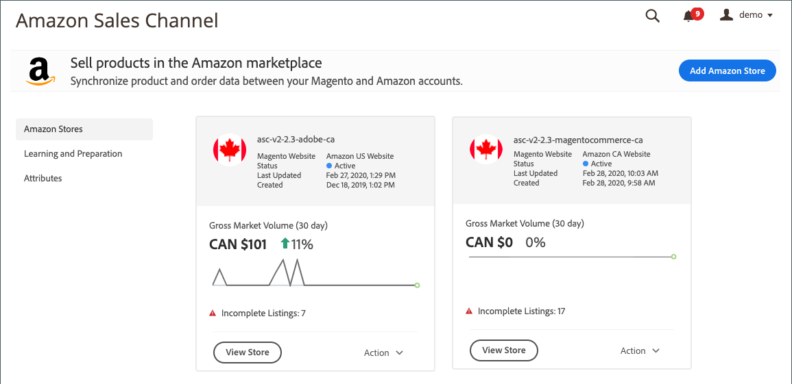

# Speicherintegration mit einem [!DNL Amazon Seller Account]

Um mit dem Amazon-Vertriebskanal zu beginnen, müssen Sie einen Amazon-Verkaufskanalspeicher erstellen (hinzufügen) und ihn mit Ihrem [!DNL Amazon Seller Account] verbinden. Diese beiden Schritte integrieren Ihre [!DNL Commerce]- und Amazon-Konten, um Daten freizugeben, Produkte zu synchronisieren und mehr.

_Sie benötigen die primären Anmeldedaten für Ihr [!DNL Amazon Seller Central] -Konto (die E-Mail oder das Telefon, mit der das Verkäuferkonto erstellt wurde), um Ihren Store zu verbinden._

>[!NOTE]
>
>Nach der ersten Store-Integration werden Sie jedes Jahr aufgefordert, Ihre Amazon-Vertriebskanalverbindung zu Amazon zu erneuern, indem Sie erneut Zugriff gewähren. Sie können diese Autorisierung in der Tabelle _Aktuelle Berechtigungen_ im Abschnitt _Amazon MWS-Entwicklerberechtigungen_ auf der Seite **Einstellungen** > **Benutzerberechtigungen** Ihres zentralen Verkaufskontos verlängern oder widerrufen.

## Hinzufügen eines Amazon-Stores

1. Wechseln Sie in der Seitenleiste _Admin_ zu **Marketing** > _Kanäle_ > **Amazon-Sales Channel**.

   Beim Hinzufügen Ihres ersten Amazon-Verkaufskanalspeichers wird das Modal _Aufgaben vor der Einrichtung_ angezeigt. Nach dem Hinzufügen Ihres ersten Stores können Sie auf der Seite &quot;[Amazon Sales Channel home](./amazon-sales-channel-home.md)&quot;unter &quot;_Lernen und Vorbereitung_&quot;im Menü links auf die Einrichtungsaufgaben zugreifen.

1. Klicken Sie auf **[!UICONTROL Add Amazon Store]**.

   Die Seite _[!UICONTROL Add Amazon sales channel]_wird geöffnet.

   {width="500" zoomable="yes"}

1. Wählen Sie für **[!UICONTROL Magento Website to use for Amazon Listing]** aus, welche Ihrer [!DNL Commerce] Websites für diesen Amazon-Verkaufskanalspeicher verbunden werden sollen.

   Mit dieser Einstellung wird auch der standardmäßige [!DNL Commerce] -Store für den [Import von Amazon-Bestellungen](./order-settings.md) definiert.

1. Geben Sie für **[!UICONTROL Email Address]** Ihre bevorzugte Kontakt-E-Mail-Adresse ein.

1. Geben Sie für &quot;**[!UICONTROL New Store Name]**&quot;einen beschreibenden Namen für den neuen Amazon-Verkaufskanalspeicher ein.

   >[!NOTE]
   >
   >Dieser Name wird nur als [!DNL Commerce] -Referenz verwendet und gibt den Store auf der Seite [Amazon Sales Channel Home](./amazon-sales-channel-home.md) an. Sie möchten es so gestalten, dass Ihr Team es leicht erkennen kann. Ihr Amazon-Store, der in den USA verkauft wird, könnte beispielsweise &quot;`Amazon Store USA`&quot;heißen.

1. Wählen Sie für &quot;**[!UICONTROL Amazon Marketplace Country]**&quot;die Region/das Land aus, in der dieser Amazon-Verkaufskanalspeicher Produkte verkauft. Optionen:

   - Vereinigte Staaten
   - Kanada
   - Mexiko
   - Vereinigtes

1. Gehen Sie im Abschnitt _[!UICONTROL Map your Magento attributes to Amazon]_wie folgt vor:

   - Wählen Sie für &quot;**[!UICONTROL Product ID on the Amazon market]**&quot;das Amazon-Attribut aus, das dem unten ausgewählten [!DNL Commerce] -Attribut zugeordnet werden soll.

     Diese ID hilft dabei, die entsprechenden Produkte in Ihrem [!DNL Commerce] -Katalog korrekt abzugleichen.

   - Wählen Sie für **[!UICONTROL Map a Magento attribute]** das Produktattribut [!DNL Commerce] aus, das dem oben ausgewählten Amazon-Attribut zugeordnet werden soll.

     [Zuordnen von Attributen](./ob-creating-magento-attributes.md) hilft sicherzustellen, dass Ihre Amazon-Liste korrekt mit dem entsprechenden Produkt in Ihrem [!DNL Commerce] -Katalog übereinstimmt.

1. Klicken Sie auf **[!UICONTROL Connect]**.

   Das Dialogfeld wird geschlossen und der neue Store wird auf der Seite [Amazon Sales Channel Home](./amazon-sales-channel-home.md) mit einer Bestätigungsmeldung angezeigt.

## Laden mit [!DNL Amazon Seller Central] verbinden

1. Klicken Sie im Store-Dashboard auf der Store-Karte auf **[!UICONTROL Connect store]** , um [!DNL Amazon Seller Central] in einer neuen Registerkarte zu starten.

1. Geben Sie Ihre [!DNL Amazon Seller Central] -Kontoanmeldeinformationen ein und klicken Sie auf **[!UICONTROL Sign in]**.

   Um diese Verbindung abzuschließen, müssen Sie sich mit den Anmeldedaten für den primären Benutzer (die E-Mail-Adresse oder das Telefon, mit der das Verkäuferkonto erstellt wurde) bei Ihrem [!DNL Amazon Seller Central] -Konto anmelden.

1. Wenn Sie dazu aufgefordert werden, schließen Sie die Amazon Two-Factor-Autorisierung (2FA) ab, indem Sie den Code eingeben, den Sie von Amazon erhalten, und klicken Sie auf **[!UICONTROL Sign in]**.

1. Aktivieren Sie auf der Bestätigungsseite _[!UICONTROL Amazon Marketplace Web Service]_das Kontrollkästchen &quot;[!UICONTROL I understand...]&quot; und klicken Sie auf **[!UICONTROL Next]**.

1. Klicken Sie in der Meldung _[!UICONTROL You are almost done]_auf **[!UICONTROL Continue]**.

   Sie haben dem Amazon-Vertriebskanal die Berechtigung zum Zugriff auf und zur Freigabe von Daten für Ihr [!DNL Amazon Seller Central]-Konto erteilt. Die Amazon-Seite wird geschlossen und eine Bestätigungsmeldung wird angezeigt.

   Die Seite &quot;[Amazon Sales Channel home](./amazon-sales-channel-home.md)&quot;mit den Amazon Store-Karten wird geöffnet.

   Um das Store-Dashboard anzuzeigen, klicken Sie auf der Store-Karte auf **[!UICONTROL View Store]** .

{width="600" zoomable="yes"}

Ihr neuer Amazon-Verkaufskanalspeicher ist jetzt mit Ihrem [!DNL Amazon Seller Central] -Konto verbunden.

 [**Fahren Sie mit dem Erstellen einer Listening-Regel fort**](./ob-create-listing-rule.md)
