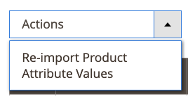

# Arbeitsbereich-Steuerelemente

Der Amazon Sales Kanal [Startseite](./amazon-sales-channel-home.md) verfügt über einige allgemeine Steuerelemente für den Arbeitsbereich, darunter Filter, Standardmäßige Ansicht, Spalten und Exportieren. Nicht alle Seiten haben die gleichen Steuerelementoptionen.

## Aktionen

Die _[!UICONTROL Actions]_Selektor bietet eine Liste von Aktionen, die einem Benutzer für eine Seite zur Verfügung stehen. Bei Auswahl dieser Option wird die Aktion auf alle ausgewählten Elemente angewendet. Um eine Aktion auf ein bestimmtes Element anzuwenden, markieren Sie das Kontrollkästchen in der ersten Spalte jedes Elements und wählen Sie eine Option unter_[!UICONTROL Actions]_.

Wenn der Selektor beispielsweise auf der _[!UICONTROL Attributes]_Seite, enthält die_[!UICONTROL Re-import Product Attribute Values]_ Aktion. Bei Auswahl dieser Aktion werden die entsprechenden Pings eingefügt [!DNL Amazon Seller Central] Konto und aktualisiert die [!DNL Commerce] Daten zu jedem der in der linken Spalte überprüften Amazon Store-Elemente.

## Filter

Die _[!UICONTROL Filters]_-Steuerelement zeigt Optionen zur Eingrenzung der in der Tabelle angezeigten Daten an. Filteroptionen basieren auf den im Spalten-Steuerelement ausgewählten Spalten. Filteroptionen werden nur für Spalten angezeigt, die im Spalten-Steuerelement aktiviert sind.

Steuerelemente für Filter können dynamische Kalender zur Eingrenzung von Daten für bestimmte Daten, Dropdown-Menüs für Spalten mit vordefinierten Auswahlen und Freitextfelder mit benutzerdefinierten Daten enthalten.

Das folgende Beispiel zeigt die Einstellungen zum Filtern der Liste von Bestellungen, sodass nur Bestellungen angezeigt werden, die die folgenden Kriterien erfüllen:

- zwischen dem 2.1.2019 und dem 2.7.2019 erteilte Aufträge und
- Bestellungen mit einem Käufer mit Namen von `Smith`und
- Bestellungen mit Status von `Shipped`.

Wenn Sie die Filteroptionen eingestellt haben, klicken Sie **[!UICONTROL Apply Filters]** , um die aufgelisteten Daten zu filtern. Klicken Sie auf Abbrechen, um das Filter-Steuerelement zu verlassen, ohne es anzuwenden.

Nachdem Sie Filter auf Ihre Daten angewendet haben, **[!UICONTROL Active Filters]** Informationen werden angezeigt. Klicken Sie auf  Symbol, um eine bestimmte Filteroption zu löschen, oder klicken Sie auf **[!UICONTROL Clear All]** um alle angewendeten Filter zu löschen.

## Ansicht

Das Ansicht-Steuerelement basiert auf den Standardspalten für die Seite und hat daher den Namen &quot;Default-Ansicht&quot;. Mithilfe des Spalten-Steuerelements können Sie verfügbare Spalten hinzufügen oder entfernen. Wenn Sie Ihre Spalten anpassen, können Sie die Ansicht als benutzerdefinierte Ansicht im Ansicht-Steuerelement speichern.

Wenn Sie Ihre Spalten hinzugefügt oder aus der Seitenanzeige entfernt haben:

1. Klick **[!UICONTROL Default View]** > **[!UICONTROL Save View As...]**.

1. Geben Sie einen Namen für die Ansicht ein.

1. Klicken Sie auf das Pfeilsymbol, um die benutzerdefinierte Ansicht zu speichern.

In diesem Beispiel _Bestell-ID_ -Spalte wird dem Spalten-Steuerelement hinzugefügt und als benutzerdefinierte Ansicht gespeichert. Beachten Sie, dass nach dem Speichern des benutzerdefinierten Ansichten der Name der Ansicht geändert wurde von _Standardmäßige Ansicht_ zum eingegebenen Namen.

Sie können zwischen den Ansichten umschalten, indem Sie die gewünschte Ansicht in der _[!UICONTROL View]_Menü.

Wenn Sie den Namen Ihrer benutzerdefinierten Ansicht löschen oder ändern möchten, klicken Sie auf das Stiftsymbol. Sie können dann einen anderen Namen eingeben oder auf das Papierkorbsymbol klicken, um die benutzerdefinierte Ansicht zu löschen. Die Standard-Ansicht kann nicht gelöscht werden.

## Spalten

Mit dem Spalten-Steuerelement können Sie Datenspalten zur Seitenanzeige hinzufügen oder entfernen. Jede Amazon Sales Kanal-Seite verfügt über eine vordefinierte Kombination aus Datenspalten, aber die meisten Seiten verfügen über zusätzliche Spalten. Wenn keine weiteren Spalten verfügbar sind, können Sie die Standardspalten aus der Anzeige entfernen.

Das folgende Beispiel zeigt ein Spalten-Steuerelement. Die aktivierten Optionen entsprechen den Spaltenüberschriften, die auf der Seite angezeigt werden.

- Aktivieren Sie das Kontrollkästchen, um Ihrer Seite eine Datenspalte hinzuzufügen.
- Aktivieren Sie das Kontrollkästchen nicht, um eine Datenspalte von Ihrer Seite zu entfernen.

Änderungen am Kontrollkästchen werden sofort angezeigt. Wenn Sie Änderungen vornehmen und die Seite verlassen, kehrt die Seite zur Standardspaltenanzeige zurück. Für regelmäßige Änderungen können Sie die Spaltenänderungen als benutzerdefinierte Ansicht im Ansicht-Steuerelement speichern. Dann können Sie im Ansicht-Steuerelement umschalten, ohne die Spalten manuell hinzufügen oder entfernen zu müssen.

Klicken Sie **[!UICONTROL Reset]** , um die Optionen auf die Standardeinstellungen zurückzusetzen, oder klicken Sie auf **[!UICONTROL Cancel]** , um ohne Ihre Änderungen zu beenden.

## Exportieren

Mit der Exportoption können Sie die Daten in eine Datendatei exportieren, die nicht in eine Software eines Drittanbieters oder eine separate Datenbank importiert werden kann. Die exportierten Daten sind auf die angezeigten Daten beschränkt. Stellen Sie bei Bedarf sicher, dass Sie Spalten hinzufügen oder entfernen, bevor Sie das Exportsteuerelement verwenden.

Wenn Sie bereit sind, Ihre Daten zu exportieren, wählen Sie eine Exportformatoption und klicken Sie auf **[!UICONTROL Export]**.

- CSV - eine kommagetrennte Wertdatei mit reinen Textdaten
- Excel XML - ein XML-basiertes Tabellendatenformat (wird normalerweise für Excel-Benutzer verwendet)

Die generierte Datendatei wird automatisch zum Download in dem angegebenen Ordner gespeichert.

