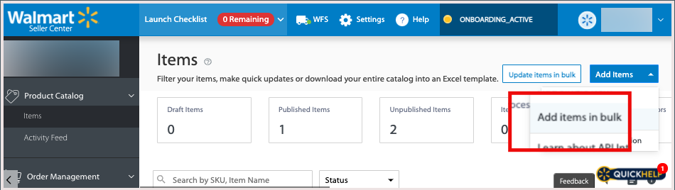

# Verbinden von Listen mit Walmart

Wie andere Marktplätze erlaubt [!DNL Walmart] Verkäufern von Drittanbietern, Artikel aufzulisten, die von anderen verkauft werden.

- [!DNL Walmart Marketplace] verwendet Produktidentifikatoren wie UPC und GTIN, um Produkte mit vorhandenen [!DNL Walmart Marketplace]-Listen abzugleichen.

- Bei übereinstimmenden Produkten listet der Walmart Marketplace Aktualisierungen auf, um das [!DNL Commerce] -Produktangebot bei der Verbindung eines Produkts von [!DNL Channel Manager] aufzunehmen.

- Normalerweise werden Produktangebote mit den niedrigsten Preisen zuerst in der Liste [!DNL Walmart Marketplace] angezeigt, andere Faktoren wie Bewertungen wirken sich jedoch auch auf die Platzierung aus.

## Produkte abgleichen

Wenn Sie Produkte abgleichen, sendet der Kanal-Manager die Produktdaten an [!DNL Walmart Marketplace] , um nach vorhandenen Listen mit Attributwerten zu suchen, die mit dem zugeordneten [!DNL Commerce] -Produktattribut übereinstimmen. Übereinstimmungskriterien werden durch die [Konfiguration der Zuordnung von Attributen](map-catalog-attributes.md) für Ihren Store-Kanal bestimmt.

Wenn eine Übereinstimmung gefunden wird, wird die vorhandene Produktliste aktualisiert, um Ihr Angebot hinzuzufügen.

### Voraussetzungen

Bevor Sie Produkte zuordnen, überprüfen Sie, ob die Produktkatalog-Attributwerte die Walmart-Anforderungen erfüllen, und konfigurieren Sie die Produktattributeinstellungen. Siehe [Zuordnen von Katalogattributen](map-catalog-attributes.md).

#### Produkte auswählen und abgleichen

1. Öffnen Sie einen verbundenen Vertriebskanal.

1. Wählen Sie unter &quot;**[!UICONTROL Listings]**&quot;Produkte für die Übereinstimmung aus, die sich im Status &quot;*[!UICONTROL Draft]*&quot;befinden.

   {width="500" zoomable="yes"}

1. Wählen Sie **[!UICONTROL Match Products]** aus.

   Eine Meldung gibt die Anzahl der Produkte an, die zum Abgleich gesendet wurden.

   Der Status für ausgewählte Produkte ändert sich in [!UICONTROL *Verarbeitung*] , bis der Match-Vorgang abgeschlossen ist. Es kann bis zu 30 Minuten dauern, bis Walmart Marketplace den Match-Vorgang abschließt.

### Prüfen des Übereinstimmungsstatus

Nachdem die Übereinstimmung abgeschlossen ist, wählen Sie &quot;**[!UICONTROL Refresh products]**&quot;aus, um den aktuellen Produktstatus anzuzeigen. *Übereinstimmung* oder *Fehler*.

- **[!UICONTROL Match]** gibt an, dass das Produkt erfolgreich abgeglichen wurde. Ihr Produktangebot war mit einer vorhandenen Walmart Marketplace-Liste verbunden. Wenn der [Marketplace-Store nicht aktiv ist](walmart-requirements.md#walmart-marketplace-store-status), wird *[!UICONTROL Staged for Match]* in der Spalte *[!UICONTROL Status detail]* angezeigt. Staging-Produkte werden automatisch verbunden, wenn der [!DNL Walmart Marketplace] -Store aktiviert wird.

- **[!UICONTROL Error]** gibt an, dass der Match-Vorgang aufgrund eines der folgenden Probleme fehlgeschlagen ist:

   - [!DNL Channel Manager] konnte aufgrund eines Verbindungsproblems nicht zur Übereinstimmung gesendet werden.

   - Es wurde keine Übereinstimmung gefunden.

   - Übereinstimmung gefunden, aber die Auflistung kann nicht verbunden werden, da [!DNL Walmart Marketplace] einen Fehlercode zurückgegeben hat. Weitere Informationen zum Problem finden Sie unter **[!UICONTROL Error Description]** .

### Checkliste für Walmart

Überprüfen Sie nach übereinstimmenden Produkten die aktualisierte Produktliste und überprüfen Sie die Produktdetails, den Preis und die Lagerbestandsmenge im [[!UICONTROL Walmart Marketplace Seller Account Items] Dashboard](https://seller.walmart.com/items-and-inventory/manage-items) , um das aktualisierte Produkt zu überprüfen.

### Fehlerbehebung bei Produktübereinstimmungsfehlern

Wenn der Vorgang der Produktübereinstimmung mit einem Fehler fehlschlägt, wird die Fehlermeldung in der Spalte *[!UICONTROL Status detail]* in der Produktliste [!UICONTROL Channel Manager] angezeigt.

Häufige Fehler, die zurückgegeben werden, sind falsch formatierte Produkt-ID-Werte oder fehlende erforderliche Attribute.

#### Produkt-ID-Werte korrigieren

| Typ | Beschreibung | Beispiel |
|------|--------------------------------------------------------------------------------------------------------------------------------------------------------------------------------|---------------------------------------------|
| UPC | GTIN-12, die 12-stellige Zahl einschließlich der Prüfziffer.   Wenn Ihr UPC weniger als 12 Stellen umfasst, z. B. UPC-E mit 8 Stellen, fügen Sie zur Erfüllung der Anforderung Nullen hinzu. | Wechsel von `45678912345` zu `045678912345` |
| GTIN | GTIN-14, die 14-stellige Zahl einschließlich der Prüfziffer.   Wenn Ihr GTIN weniger als 14 Stellen enthält, fügen Sie führende Nullen   hinzu, um die Anforderung zu erfüllen. | `456789123456` in `0045678912345` ändern |
| EAN | GTIN-13, die 13-stellige Zahl einschließlich der Prüfziffer.   Wenn Ihr EAN weniger als 13 Stellen enthält, fügen Sie führende  Nullen hinzu, um die Anforderung zu erfüllen. | Wechsel von `4567891234` zu `0004567891234` |

Weitere Informationen zu den Fehlercodes von Walmart Marketplace finden Sie in der [Walmart Seller Help](https://sellerhelp.walmart.com/s/guide?article=000005844).

## Hochladen neuer Produktlisten

Verwenden Sie für Produkte, die auf dem Walmart Marketplace nicht übereinstimmen, eine Excel-Vorlage der Walmart-Produktkategorie, um Produktlisten stapelweise hochzuladen. Sie füllen die Walmart-Vorlage mit Produktkatalogdaten, die aus Ihrer [!DNL Commerce] -Instanz exportiert wurden.

Überprüfen Sie Ihren Produktkatalog für neue Produktlisten, um sicherzustellen, dass Produkte, die Sie auf dem Walmart Marketplace verkaufen möchten, über die für Produktlisten im Walmart Marketplace erforderlichen Attribute verfügen.

**Walmart Marketplace listings-Attribute requirements**

| **Attribut** | **Anforderungsstufe** |
|--------------------------|-----------------------|
| SKU | Erforderlich |
| Produktname | Erforderlich |
| Produkt-ID-Typ | Erforderlich |
| Produkt-ID | Erforderlich |
| Marke | Erforderlich |
| Kurzbeschreibung | Erforderlich |
| Verkaufspreis | Erforderlich |
| Site-Beschreibung | Erforderlich |
| URL des Hauptbilds | Erforderlich |
| Versandgewichtung | Erforderlich |
| Wichtigste Funktionen | Empfohlen |
| Modellnummer | Empfohlen |
| Name des Herstellers | Empfohlen |
| Teilenummer des Herstellers | Empfohlen |
| Größe | Empfohlen |
| Farbe | Empfohlen |
| URL des Hauptbilds | Optional |
| Zusätzliche Bild-URL | Optional |
| Hersteller | Optional |

### Voraussetzungen

- Stellen Sie sicher, dass Sie die [Walmart-Anforderungen](walmart-requirements.md) erfüllen.

- Überprüfen Sie in Ihrem [!DNL Commerce] -Produktkatalog, ob die Katalogkonfiguration für die Produkte, die auf dem Walmart Marketplace aufgelistet werden sollen, alle erforderlichen Attribute aufweist und den Inhaltsrichtlinien von Walmart Marketplace entspricht.

- Stellen Sie sicher, dass der Cron-Auftrag ausgeführt wird, um den Exportvorgang abzuschließen.

   - Informationen zu lokalen Instanzen finden Sie unter [CRON konfigurieren und ausführen](https://experienceleague.adobe.com/docs/commerce-operations/configuration-guide/cli/configure-cron-jobs.html).

   - Informationen zur Adobe-Cloud-Infrastruktur finden Sie unter [Einrichten von Cron-Aufträgen](https://experienceleague.adobe.com/docs/commerce-cloud-service/user-guide/configure/app/properties/crons-property.html).

### Erstellen der hochzuladenden Produktdatendatei

1. Laden Sie von Ihrem [Walmart Seller-Konto](https://login.account.wal-mart.com/authorize?responseType=code&amp;clientId=66620dfd-1f3f-479b-8b9c-e11f36c5438b&amp;scope=openId&amp;redirectUri=https://seller.walmart.com/resource/login/sso/torbit&amp;nonce=SX17QLMBKR&amp;state=ZBWWNZXXXM&amp;clientType=seller) eine Produktlisten-Vorlage vom Walmart Seller Center herunter.

   - Wählen Sie auf der Seite &quot;Produktkatalogelemente&quot;die Option **[!UICONTROL Add Items]** aus. Wählen Sie dann **[!UICONTROL Add items in bulk]** aus.

     {width="600" zoomable="yes"}

   - Wählen Sie auf der Download-Seite **[!UICONTROL Full Setup]** aus. Wählen Sie dann eine Elementkategorie aus und laden Sie die Kategorievorlage herunter.

     {width="600" zoomable="yes"}

   - Stellen Sie sicher, dass die Vorlage die erforderlichen und empfohlenen Attribute für die Produktliste enthält.

1. Wählen Sie unter [!DNL Commerce] Admin die Produktdaten aus, die von Ihrer Adobe [!DNL Commerce]-Site exportiert werden sollen.

   - Wählen Sie im Admin [!UICONTROL **System** > Datenübertragung > **Export**] aus.

   - Wählen Sie auf der Seite [!UICONTROL Export] im Feld [!UICONTROL Entity Type] die Option [!UICONTROL **Produkte**] aus.

   - Konfigurieren Sie in der Tabelle [!UICONTROL Entity Attributes] die Auswahlkriterien für den Export von Produktdaten.

     Verwenden Sie Filter, um die Attributwerte auszuwählen und zu konfigurieren, die für die Produktkategorien gelten, in denen Sie verkaufen. Stellen Sie sicher, dass Sie die erforderlichen und empfohlenen Attribute von Walmart einbeziehen. (Detaillierte Anweisungen finden Sie unter [Daten exportieren](https://experienceleague.adobe.com/docs/commerce-admin/systems/data-transfer/data-export.html) im Adobe [!DNL Commerce]-Benutzerhandbuch.)

     Um ein Attribut aus dem Export auszuschließen, aktivieren Sie das Kontrollkästchen [!UICONTROL **Ausschließen**] am Anfang der Zeile.

1. Scrollen Sie zum Ende der Attributtabelle und wählen Sie [!UICONTROL **Weiter**] aus, um den Datenexport zu starten.

   Die CSV-Exportdatei wird mithilfe von Cron-Aufträgen über eine Nachrichtenwarteschlange verarbeitet und im Ordner &quot;`var/export/folder`&quot;gespeichert. (Siehe [Verwalten von Nachrichtenwarteschlangen](https://experienceleague.adobe.com/docs/commerce-operations/configuration-guide/message-queues/manage-message-queues.html) im *Konfigurationshandbuch*.)

1. Öffnen Sie die Excel-Vorlage für die Produktkategorie Walmart Marketplace und führen Sie die exportierten Produktdaten mithilfe von Excel-Makros in die Excel-Vorlage zusammen.

1. Laden Sie die Excel-Datei mit den exportierten Produktdaten hoch.

   - Kehren Sie zur Seite &quot;Produktkatalog-Elemente&quot;im [Walmart Seller Center](https://login.account.wal-mart.com/authorize?responseType=code&amp;clientId=66620dfd-1f3f-479b-8b9c-e11f36c5438b&amp;scope=openId&amp;redirectUri=https://seller.walmart.com/resource/login/sso/torbit&amp;nonce=SX17QLMBKR&amp;state=ZBWWNZXXXM&amp;clientType=seller) zurück.

   - Wählen Sie [!UICONTROL **Elemente hinzufügen** > **Elemente stapelweise hinzufügen**].
   - Ziehen Sie die abgeschlossene Tabelle in den Bereich Hochladen .
   - Wählen Sie [!UICONTROL **Senden**] aus.
   - Wählen Sie den [!UICONTROL  **Aktivitäts-Feed**] aus, um den Fortschritt anzuzeigen.

Vollständige Anweisungen finden Sie unter [Elemente stapelweise mit dem vollständigen Artikel-Spec hinzufügen](https://sellerhelp.walmart.com/s/guide?article=000007680) in der [!DNL *Walmart Seller Help*].
