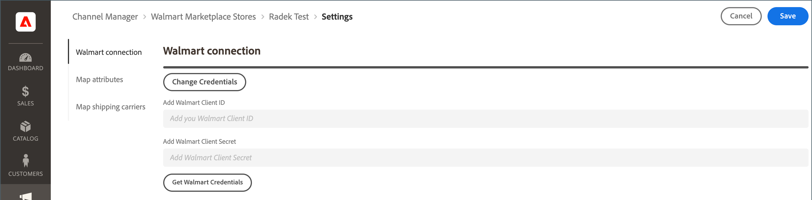

# Versandunternehmen zuordnen

Bevor Sie [Bestellaufträge](process-orders.md#ship-an-order) für [!DNL Walmart Marketplace] Bestellungen verarbeiten, ordnen Sie die von Walmart bevorzugten Versandunternehmen dem entsprechenden Beförderer in [!DNL Commerce] zu, damit die Versanddaten zwischen [!DNL Walmart] und [!DNL Commerce] synchronisiert werden können.

Commerce-Träger, die keinem bevorzugten Träger zugeordnet sind, werden unter [!DNL Walmart] als *[!UICONTROL Other Carrier]* gekennzeichnet.

**Voraussetzungen**

Überprüfen Sie die [Walmart-Anforderungen](walmart-requirements.md) für die [!DNL Marketplace Seller account].

## Verbindungsberechtigungen aktualisieren

1. Wählen Sie auf der Seite [!UICONTROL Listings] für den Verkaufskanalspeicher **[!UICONTROL Channel Settings]** aus.

1. Wählen Sie auf **[!UICONTROL Channel Settings]** **[!UICONTROL Walmart Connection]** aus.

1. Um die Anmeldeinformationen zu ändern, wählen Sie **[!UICONTROL Change Credentials]** aus.

   {width="700" zoomable="yes"}

1. Geben Sie die Werte **[!UICONTROL Walmart Client ID]** und **[!UICONTROL Walmart Client Secret]** ein.

1. Wählen Sie **[!UICONTROL Save]** aus, um die Konfiguration anzuwenden.
