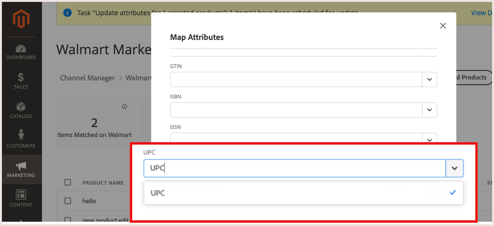

# Konfigurieren der Produktübereinstimmung

Bevor Sie Listen in Walmart Marketplace veröffentlichen, ordnen Sie mindestens eine eindeutige Kennung aus Ihren Produktkatalogattributen einer der erforderlichen Walmart Marketplace -Produktkennungen zu. Dieser Schritt ist erforderlich, um Produkte auf dem Walmart Marketplace zuzuordnen.

Für die Produktzuordnung muss das Commerce-Produkt mindestens eine der folgenden Produkt-IDs (Produkt-IDs) in den Katalogattributen enthalten.

**Erforderliche Walmart-Produkt-IDs**

| **Akzeptierter Typ** | **Name** | **Zweck** | **Zulässige Ziffern** |
|-------------------|--------------------------------------|--------------------------------------------------------------------------------------------------------------------------------------------------|-----------------------|
| GTIN | Globaler Handelsartikel | Allgemeine Verwendung weltweit | 14 Stellen |
| ISBN | Internationale Standardbuchnummer | Papiere, Hardcover und elektronische Bücher | 10 oder 13 Stellen |
| ISSN | Internationale Standardseriennummer | 8-stellige Seriennummer zur Identifizierung von Zeitschriften, Zeitschriften, Zeitungen und Zeitschriften aller Art, die auf allen gedruckten Medien und auf elektronischem Wege zugestellt werden | 8 Stellen |
| ISBN | Internationale Standardbuchnummer | Paperback, Hardcover und Elektronisch | 12 Stellen |

Wenn Ihr Katalog einen anderen Typ von Produkt-ID-Attribut enthält, konvertieren Sie es in einen der erforderlichen Typen. Ordnen Sie es dann dem entsprechenden Walmart Marketplace -Attribut in der Konfiguration &quot;Listen&quot;für den Kanal-Manager-Store zu.

## Produktattributeinstellungen konfigurieren

1. Wählen Sie auf der Produktlistenseite für den verbundenen Vertriebskanal ein oder mehrere Produkte in *Entwurf* Status.

1. Auswählen **[!UICONTROL Settings]**.

   - Suchen Sie nach dem Attribut Walmart Marketplace , das zugeordnet werden soll.

   - Wählen Sie das entsprechende Attribut aus dem Store-Katalog aus.

      Im folgenden Beispiel wird das UPC-Attribut Walmart Marketplace dem Attribut UPC im Produktkatalog zugeordnet.
   

   - Auswählen **[!UICONTROL Save]**.

## Zugeordnete Attributkonfiguration aktualisieren

Ändern Sie die Commerce-Produktkennung für übereinstimmende Produkte, indem Sie die zugeordneten Attributeinstellungen aktualisieren.

Anstatt beispielsweise Produkte auf Grundlage des Commerce UPC-Produktattribut-Codes zuzuordnen, können Sie eine Übereinstimmung anhand der SKU herstellen. Sie können auch zusätzliche Attribute zuordnen, um die Übereinstimmung zu verbessern.

1. Aus dem **[!UICONTROL Listings]** auswählen **[!UICONTROL Settings]**.

1. Ändern Sie im Formular Zuordnungsattribut die zugeordnete Attributkonfiguration nach Bedarf.
